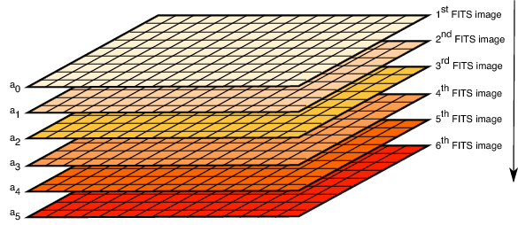

.. _calibration files:

aXe Calibration Files
=====================

The aXe tasks use several calibration files in addition to
the information contained in the Main Configuration File (see
:ref:`main_configuration_file`). This section describes these files.

.. _senstitivity_curve:

Sensitivity Curve
-----------------

This file is a FITS binary table containing the three
columns WAVELENGTH, SENSITIVITY, ERROR and listing the total system
sensitivity (in :math:`e^-/s` per erg cm\ :math:`^{-2}` s\ :math:`^{-1}`
Å\ :math:`^{-1}`) as a function of wavelength (in A). The ERROR column
should contain the estimated error in the SENSITIVITY (in :math:`e^-/s`
per erg cm\ :math:`^{-2}` s\ :math:`^{-1}` A\ :math:`^{-1}`). Note: this
sensitivity curve should be per Å and not per pixel.

.. _calibration_flat_field:

Flat field
----------

This file is a multiple extension FITS file containing a
model of the wavelength dependence of the flat-field for each pixel.

Each extension :math:`i` of this file contains the :math:`n^{th}`
polynomial coefficient of the relation

:math:`f(i,j,x)=a_0 + a_1 * x + a_2 * {x}^{2} + ... + a_i * {x}^n`,
where 

:math:`x` is a normalized value obtained with

:math:`x = (\lambda - {\lambda}_{min})/(\lambda_{max} - \lambda_{min})`

and 

:math:`\lambda` is the wavelength of the pixel (i,j). The values for

:math:`\lambda_{max}` and :math:`\lambda_{min}` 

are in the FITS header keywords :math:`WMIN` and :math:`WMAX`. There are no hard limits on the
number of extensions in this file, i.e. on the order of the polynomial
model. The task petff is used to read this file, compute and apply the
flat-field coefficient at each pixel contained in a Pixel Extraction
Table. This is done by *dividing* the pixel value by the computed
flat-field coefficient. The structure of this file is shown in :num:`figure #fitsflat`
. Note that the first extension of this file, [0],  contains the constant term of the polynomial.

.. _fitsflat:

    
    The structure of the FITS flat-field calibration file which is used by aXe
    to  construct, at each pixel coordinat(i,j) a proper flat-field coefficient
    :math:`FF(i,j,x)=a_0 + a_i * x + a_2 * x^2 +  ... + a_i * x^n` where :math:`x`
    is a normalized balue obtained with :math:`x=(\lambda - \lambda_{min}) / (\lambda_{max} - \lambda_{min})` and
    :math:`\lambda` is the wavelength of pixel(i,j).
