.. _description:

Description
===========

What is aXe?
------------

The aXe software was designed to extract spectra in a consistent manner
from all the slitless spectroscopy modes provided by the **W**\ ide
**F**\ ield **C**\ amera 3 (WFC3) and the **A**\ dvanced **C**\ amera for
**S**\ urveys (ACS), which were installed on the Hubble Space Telescope in
May 2009 and February 2002, respectively. What we refer to as aXe is in
fact a PyRAF/IRAF package with several tasks that can be used to produce
extracted spectra. There exist two classes of aXe tasks, see :num:`figure #comm-over`).

.. _comm-over:

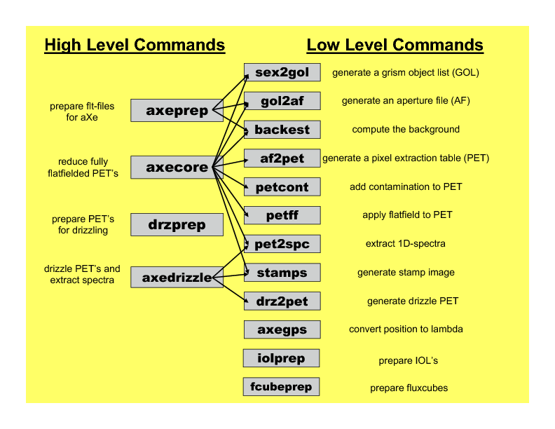
    
    The list of aXe tasks. 

#. The Low-Level Tasks work on individual grism images. All input and
   output refers to a particular grism image.

#. The High-Level Tasks work on data sets. Their aim is to perform a
   series of processing steps for a set of images.

The High-Level Tasks often use the Low-Level Tasks to do a certain
reduction step on each frame (see :num:`figure #comm-over` ).

The High-Level Tasks were designed to cover all steps of the aXe
reduction without any restriction in functionality. All tasks are
controlled through a set of configuration files , which can be edited by
the user and optimized for a given data set.

The core of the software package is written using ANSI C and and is
highly portable from one platform to another. aXe uses the third-party
libraries CFITSIO, GSL, and WCSLIB, which have been successfully
employed under Linux, Solaris, and MacOS X.

aXe is distributed as part of the STSDAS software package. Within
STSDAS, aXe is located under the subpackages analysis.slitless.axe

aXe has been used successfully in several large science programs, such
as GRAPES (ACS/WFC, [PIRZKAL1]_ ) and PEARS (ACS/WFC, [PIRZKAL2]_ ). The aXe software was
central in extracting ACS/G800L and, using a customized version of aXe,
NICMOS/G141 data within the corresponding Hubble Legacy Archive (HLA)
projects (see [FREUDLING]_ and [KUMMEL4]_).

Slitless Spectroscopy
---------------------

In conventional spectroscopy, slits or masks are
used to allow only the light from a small portion of the focal plane of
the telescope to enter the dispersing device (e.g. grism, grating or
prism). This results in an unambiguous conversion between pixel
coordinates on the detector and wavelength.

In slitless spectroscopy there is no unique correspondence between pixel
coordinates and wavelength. Consequently, the spectral reduction on the
basis of the spectroscopic data alone is very difficult. Additional
information concerning the positions of the object must be added to
facilitate the spectral reduction. In aXe this is done by providing an
Input Object List (IOL) at the beginning of the reduction process. In
the Input Object List the object positions are given in the
image-coordinate system or the world coordinate system. This allows the
determination of the so called *reference pixel* for every object. The
reference pixel is the undispersed object position in image coordinates
on the grism data. For each individual object, it is then possible to
assign a wavelength to each pixel.

In conventional spectroscopy the extraction of the 1D spectra from the
2D data is done along the direction of the slit or mask. In slitless
spectroscopy, such a predefined extraction direction does not exist. It
is in fact possible to define a different extraction direction for each
object individually by adjusting the wavelength assignment to be
constant along the chosen extraction direction (see :num:`figure #geometry1`). 
In aXe the default action is to set the extraction direction to be parallel to the object position angle as
given in the Input Object List.

.. _geometry1:

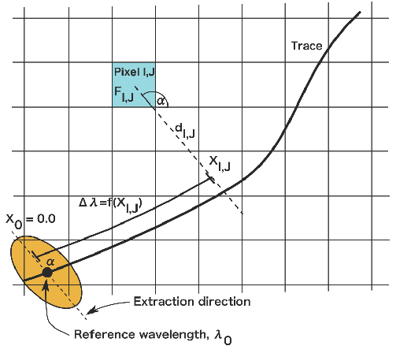
    
    The geometry in a beam. :math:`\alpha` is the orientation of an extended object. A single wavelength is 
    assigned to each pixel within a beam. An extraction along an arbitrary  direction :math:`\alpha` with 
    repect to the pixel grid is allowed. This optimizes the resolution  of the final extracted spectrum. 

The absence of slits and masks also dramatically enhances the
probability that spectra of different sources overlap each other. Even
at large distances along the dispersion direction, the different orders
of two objects still can overlap and create confusion problems. aXe can
mark and extract several dispersion orders per object to properly record
the source confusion or contamination for every order of each object.

Apertures and Beams
-------------------

The extraction process in aXe is done on the basis of so called
*BEAM*\ s. Each beam comprises one dispersion order of one object. The
collection of all beams (dispersion orders) of one object is called the
*APERTURE*. The aperture is characterized by the aperture number, which
is identical to the object number in the Input Object List. The beams
are named with a single character. The alphabetical sequence (A, B, C,
...) follows the sequence of beams defined in the Configuration File.
Each beam is defined by the coordinates of the quadrangle which contains
the pixels that are extracted together to form the spectrum of one
dispersion order of an object.

The beams follow the spectral trace of the spectrum, which is defined in
the Configuration File (see :ref:`configuration_files` for a detailed description). 
While the length of a beam is set by the length of the
corresponding dispersion order, its width is adapted to the extraction
width set by the user.

.. _cont-im:

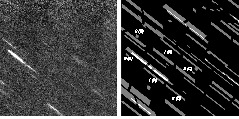
    
    A grism image of the HUDF HRC Parallels Program (left panel) and the aXe-beams
    therein (right paenl). The numbers and characters give the spectra order and the beam label in aXe. 
    The bright areas mark the overlap of several beams.
    
    

The left panel in :num:`figure #cont-im` shows an HRC/G800L grism exposure
reduced in the HUDF HRC Parallels Program (cleaned from cosmic-ray
hits). In the right panel, some of the beams marked and extracted in aXe
are indicated. The numbers give the spectral order, and the letters
denote the correspondence with the beam in the configuration file. The
bright areas mark regions where beams overlap and contaminate their
spectra mutually. The different extraction angles for the objects result
in different shapes of the marked regions. For each beam the description
of the spectral trace and the wavelength assignment is set up and the
spectral reduction is done independently.

Pixel Extraction Tables (PET)
-----------------------------

An important step in the aXe reduction process is the generation of the
so called *Pixel Extraction Table* (PET). A PET is a multi-extension
fits-table which stores in each extension the complete spectral
description of all pixels of one beam. :num:`figure #geometry1` illustrates the 
geometry in a beam and shows various quantities stored
in the PET. Important pixel information stored in the PET is:

-  the *section point*, defined as the point where the spectral trace
   intersects a line drawn through the centre of the pixel along the
   extraction direction

-  the distance to the section point :math:`d_{ij}`

-  the trace distance :math:`X_{i,j}` of the pixel (which is equal to
   the trace distance of the section point)

-  the wavelength attributed to the pixel (derived by inserting the
   trace distance into the dispersion function stored in the
   configuration file)

The PETs are read and manipulated by many aXe tasks. For example, a
flat-field correction is applied to the pixel values stored in the PETs.
Since flat-fielding is a wavelength dependent operation, the assignment
of a wavelength to each pixel is required before the correction values,
derived from a 3D flatfield cube are applied(see :ref:`Flat Fields <calibration_flat_field>`).

.. _geometry2:

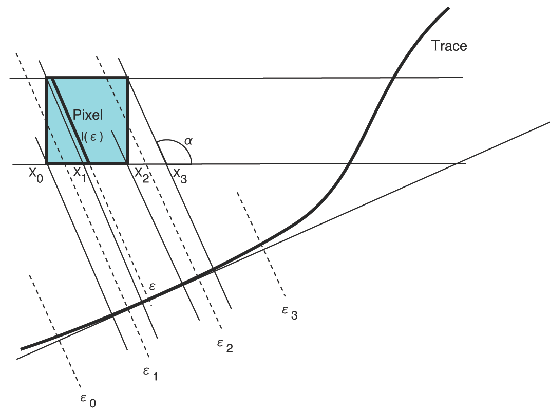
    
    How a one-dimensional spectrum is created using information from the Pixel
    Extraction Table. Each pixel in the table is projected onto the trace into 
    separate wavelength bins. The number count of each pixel is weighted by the
    fractional area of that pixel which falls onto a particular bin.

Generating 1D spectra
---------------------

The geometry required to convert the contents of the PET to a set of one
dimensional spectra stored in the Extracted Spectra File (SPC) (see :ref:`extracted spectral formats<formats_extracted_spec_file>`)
is shown in :num:`figure #geometry2`. The method
accounts for the geometrical rotation of the square pixel with respect
to the spectral trace and appropriately projects each pixel onto the
trace. To do this a weighting function is used which is the fractional
area of the pixel which, when projected onto the trace, falls within the
bin points :math:`\epsilon_1` and :math:`\epsilon_2`. The flux contained
in each BEAM pixel is weighted by this weighting function as it is
projected onto separate bins (:math:`\epsilon_0` to :math:`\epsilon_1`,
:math:`\epsilon_1` to :math:`\epsilon_2`, and :math:`\epsilon_2` to
:math:`\epsilon_3` in :num:`figure #geometry1`) along the spectral
trace. The weight is computed by integrating over the length of the
segments such as :math:`l(\epsilon)` shown in :num:`figure #geometry2`. 
The length of these segments is nonzero from
:math:`x_0` to :math:`x_3`, reaches a maximum value of
:math:`1/sin(\alpha)`, and rises and decreases linearly such that it can
be described by:

.. math::
  :label: length_of_segments
  :nowrap:

  l(x) = \left \begin{array}{ll} \\
    m(x-x_0)  & {if x_0 \le x \le x_1} \\
     l_{max}  & {if  x_1 \le x \le x_2} \\
   m(x_3 - x) & {if x_2 \le x  \le x_3} \\
            0 & {otherwise}\end{array} \right

    where  m=l_{max} / (x_1-x_0)
    
Integration over this function :math:`l(x)` to compute :math:`w(\epsilon_0,\epsilon_1), w(\epsilon_1,\epsilon_2)`, and
:math:`w(\epsilon_2,\epsilon_3)` is trivial once :math:`x_0,...,x_3` have been computed, which are derived from simple trigonometry.

.. _back-ims:

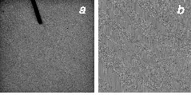
    
    Left panel (a): The master sky for the HRC. The holder for the 
    coronograph results int he 'arm' with low sensistivity at the top.
    Right panel (b): Background estimate for the grism image show in :num:`figure #cont-im`
    with the object regions masked.
    
    
Once the one dimensional spectra have been generated, the final step of
flux calibrating can be performed by applying a known sensitivity curve
for the observing mode which was used. The output product of the aXe
extraction process is a FITS binary table containing the set of
extracted and calibrated spectra (see :ref:`extracted spectral formats<formats_extracted_spec_file>`).

Sky Background
--------------

aXe has two different strategies for removal of the sky background from
the spectra.

The first strategy is to perform a global subtraction of a scaled
master-sky frame from each input spectrum image at the beginning of
the reduction process. This removes the background signature from the
images, so that the remaining signal can be assumed to originate from
the sources only and is extracted without further background correction
in the aXe reduction.

The second strategy is to make a local estimate of the sky background
for each BEAM by interpolating between the adjacent pixels on either
side of the BEAM. In this case, an individual sky estimate is made for
every BEAM in each science image.

The strategy of estimating a local sky background can also be applied
after a global sky background subtraction for very difficult cases or
instruments (e.g. NICMOS G141 data, see [FREUDLING]_ ).

.. _global_background_subtraction:

Global Background Subtraction
~~~~~~~~~~~~~~~~~~~~~~~~~~~~~

The homogeneous background of HST grism exposures makes the
global background subtraction from the pipeline processed science images
(i.e. _flt.fits files) feasible. Master sky images for both ACS (WFC
and HRC) and WFC3 are available from the instrument web pages at
http://www.stsci.edu/hst/wfc3/analysis/grism_obs/wfc3-grism-resources.html

All master sky images were created by combining many grism images from
different science programs. The object signatures on the science images
were removed using several techniques, including a two step median
combination, to derive a high signal-to-noise image of the sky
background. :num:`figure #back-ims` shows the ACS/HRC master sky
image.

Scaling and subtraction of the master sky is done with the aXe task
axeprep (see :num:`figure #cont-im`). Before scaling the master
sky to the level of each science frame, the object spectra are masked
out on both the science and the master sky image.

When reducing a dataset consisting of many individual exposures, it may
be desirable to check the sky subtraction by co-adding all the sky-subtracted
grism images (e.g. with the Astrodrizzle task). The co-added image also provides
a way to quickly assess the quality of the background subtraction. Any deviations
from zero in the mean background level of the combined image will also affect the
spectra derived withthe aXe reduction.

.. _local_background_subtraction:

Local Background Subtraction
~~~~~~~~~~~~~~~~~~~~~~~~~~~~

The second option for handling the sky background is to make a local
estimate of the background for each object. In this case, aXe creates an
individual background image for each object on the spectrum image. On
the background image the pixel values at the positions of the object
beams are derived by interpolating in each column between the pixel
values on both sides of the beam. The number of pixels used in the
interpolation as well as the degree of the interpolating polynomial can
be chosen by the user. :num:`figure #back-ims` shows the background
image corresponding to the grism image displayed in :num:`figure #cont-im`.

The background images are then processed in much the same way as the
science images, resulting in a *Background Pixel Extraction Table*
(BPET) for all BEAMs in a grism image. Thus, every PET has its
corresponding BPET, derived from the background image, with the spectral
information of the identical objects and beams in it. Finally, the BPET
is subtracted from the PET and the background subtracted spectra are
extracted.

.. _contamination:

Contamination
-------------

In conventional spectroscopy an overlay of spectra from different
sources can occur only if two or more objects fall within the aperture
defined by a slit or mask element. However in slitless spectroscopy
there is no spatial filtering of sources. This allows both overlap of
spectra from near neighbours in the cross dispersion direction as well
as from more distant sources in the dispersion direction. For this
reason spectral overlap or contamination is an ubiquitous issue for
slitless spectroscopy, which must be explicitly taken into account in
the data reduction.

Geometrical contamination
~~~~~~~~~~~~~~~~~~~~~~~~~

In *geometrical contamination* the areas covered by the different orders
of all objects are recorded on a so-called contamination image. :num:`figure #cont-im`
and :num:`figure #geom-cont` show the contamination image for data
taken in the Hubble Ultra Deep Field with the HRC and WFC, respectively.
In both figures the regions marked black are covered by no spectrum at
all, the white or red areas show regions which are covered by several
(up to 15 in :num:`figure #geom-cont` overlapping spectra, which
contaminate each other.

.. _geom-cont:

.. figure:: images/geom_cont.png
    :align: center
    
    The contamination image compiled for data taken in the Hubble Ultra Deep Field
    The difference colours give the number of spectral orders which contaminate each other.    

The information on the number of contaminating sources in
:num:`figure #geom-cont` is stored in the object PET and fully
propagated in the 1D extraction of the individual object spectra. As a
final result each spectral element is accompanied by a flag which
indicates whether its input pixels were also part of other object
spectra. The regions of 1D spectra where the contamination flag is set
must be used with care, since neighbouring sources also contribute to
the extracted flux.

This contamination scheme is fast and very efficient in identifying
problematic regions in the individual object spectra, however there is
no information on the severity of the contamination.

The quantitative contamination introduced below assesses the
contamination from neighbouring sources and helps to decide whether the
contaminated spectrum might still be suitable for further scientific analysis.

.. _quantitative_contamination:

Quantitative contamination
~~~~~~~~~~~~~~~~~~~~~~~~~~

The *quantitative contamination* gives, for each
spectral element, an estimate on the contaminating flux from all other
sources. Based on this quantitative contamination estimation, the user
has a better tool to decide which data points can be trusted.

The basis of the quantitative contamination estimation is a model which
estimates the dispersed contribution of every object to the grism image.
The contributions of the individual objects are then coadded to a 2D
contamination image, which is a quantitative model of the examined grism
image. In the 1D extraction of the individual object spectra, the model
contribution of the object itself is subtracted (to avoid
self-contamination), and then the data from the modelled grism image is
processed in parallel with the data from the real grism image.

.. _gauss-cont:

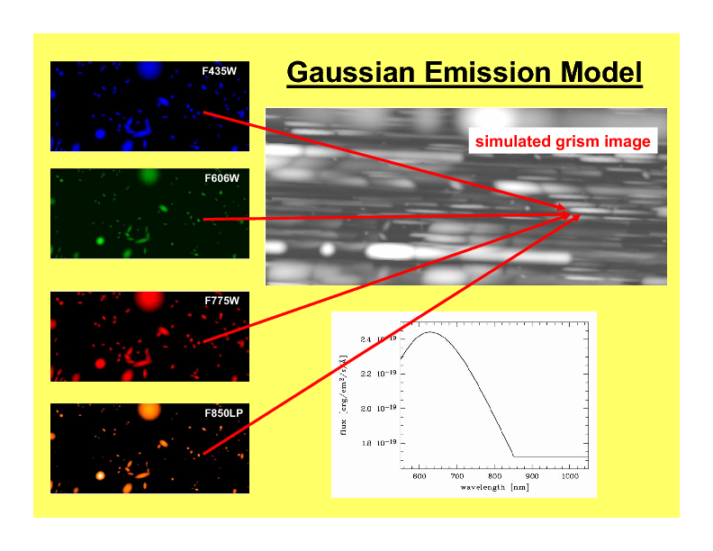
    
    The Gaussian emission model for ACS/WFC: photometric information
    in four filters show on the left is emplyed to compute the model grism image(right).
    The object morphologies are approximated by 2D Gaussians. The arrows
    connect the direct image positions of one object to its first order 
    grism spectrum. The photometric values are transformed to flux and interpolated
    as shown on the lower right side.
    
    
As a result two spectra for every object are derived: one extracted from
the real grism image; and a second one extracted from the modelled grism
image. Since the model contribution of the object itself was excluded in
the extraction of the latter spectrum, this spectrum is a quantitative
estimate of the contamination from all other sources to the object
spectrum in question. The accuracy of the contamination spectrum is set
by the accuracy of the *emission model* which is needed as an input to
compute the modelled grism image.

Two different emission models have been implemented, called the
*Gaussian Emission Model* and the *Fluxcube Model*

The Gaussian Emission Model
'''''''''''''''''''''''''''

In the Gaussian emission model, the object morphologies are approximated
by Gaussians with widths taken from the Input Object List. The Input
Object List must also contain photometric information, which is provided
by the total AB-magnitude in at least one filter passband or wavelength.
In this mode the column name of the magnitude columns must indicate the
wavelength with a simple format (such as MAG\_F850LP for an AB-magnitude
determined at 850nm, see Chapt. [SEX] for details on the column names).
With a proper name for the magnitude column, the Input Object List,
which is required to run aXe, contains all the data to compute the
contamination with the Gaussian emission model.

.. _fluxc-cont:

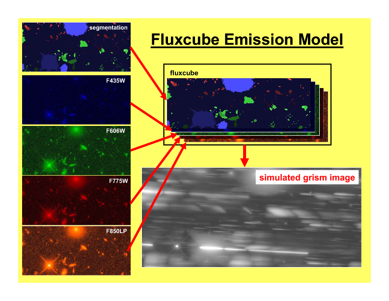

    The Fluxcube emission model for ACS/WFC: reali images in four filters (left) are converted
    to flux images and combined with the segmentation image to a fluxcube file (upper right).
    The model grism image (lower right) is computed using the data in the fluxcube.
    
    
:num:`figure #gauss-cont` displays on the left side the ACS/WFC direct
images in the four observed filters as seen in the Gaussian emission
model, which means all objects have Gaussian shapes. The upper right
panel of :num:`figure #gauss-cont` shows the modelled ACS/WFC/G800L
grism image computed from the morphological and photometric information.
The arrows point from the direct image positions of one object to the
position of its first order spectrum in the modelled grism image. In
order to compute the contribution of this object to the grism image, the
four photometric values (AB-magnitudes at :math:`435`, :math:`606`,
:math:`775` and :math:`850`\ nm) were transformed to flux and then
interpolated with a cubic spline as shown in the lower right panel of
:num:`figure #gauss-cont`. Outside the range of the photometric data a
constant extrapolation of the last available data point is used.

The images in :num:`figure #gauss-cont` cover the same area as the
contamination image in :num:`figure #geom-cont`. The direct images in
:num:`figure #gauss-cont` were only created for illustration purposes.
In real aXe runs, each filter is just represented by a column in the
Input Object List which gives the total AB-magnitude of the objects.

The Fluxcube Model
''''''''''''''''''

In the Fluxcube emission model both the object morphologies as well as
the spectral information are taken from the fluxcube file associated
with every grism image. A fluxcube file is a multi-dimensional fits
image with one or several flux images taken at different wavelengths as
extensions. The basis of the flux images are normal 2D images in
:math:`[counts/sec]`, which must be transformed to flux in
:math:`[erg/cm^2/s/Ã…Â]` using the appropriate zeropoints. All
extensions of the fluxcube image must cover the same area as the
corresponding grism image.

The flux extensions in the fluxcube provide sufficient information to
compute a model grism image. In the determination of the quantitative
contamination however it is essential to derive the individual
contribution of each object to the modelled grism image. This addition
is necessary to be able to subtract the self contamination and to
isolate the contamination from other sources for each individual object.

For this reason the first extension of a fluxcube image must contain the
so called "Segmentation Image". In the segmentation image each pixel
value is the (integer) number of the object to which the pixel is
attributed. The SExtractor software provides the possibility to create a
segmentation image (parameter setting: CHECKIMAGE\_TYPE SEGMENTATION) as
an additional output product of the source extraction.

The fluxcube files necessarily follow a rather complicated file format.
To support the user in the creation of fluxcube files an aXe task has
been implemented. The task fcubeprep works in a standard scenario with a
drizzled grism image, one or several drizzled direct images
and a segmentation image as input.

As an illustration of the Fluxcube model for ACS/WFC, :num:`figure #fluxc-cont`
shows on the left side the segmentation image and
the filter images used to create the fluxcube. The lower right part of
:num:`figure #fluxc-cont` displays the modelled ACS/WFC/G800L grism
image derived by the fluxcube emission model. All images in
:num:`figure #fluxc-cont` cover the identical area of
:num:`figure #gauss-cont` and :num:`figure #geom-cont` in the HUDF.

More details on quantitative comtamination are given in and .

Drizzling of PETs
-----------------

[drizzlingPETs] The aXe reduction scheme described up to now produces
one spectrum for each individual beam in each science image. However,
datasets, such as those obtained with ACS, often consist of several
images with small position shifts (dithers) between them. The direct
approach of co-adding the 1D spectra extracted from each image to form a
combined, deep spectrum has several disadvantages:

-  The data is (non-linearly) rebinned twice, once when extracting the
   spectrum from the image and again when combining the individual 1D
   spectra;

-  A complex weighting scheme is required to flag cosmic ray affected
   and bad pixels;

-  Low level information on the cross dispersion profile is lost when
   many 1D extracted spectra are combined to a deep spectrum.

.. _drizzle-exa2:

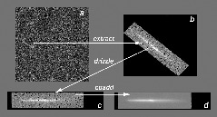
    
    Drizzling in aXe: The object marked in panel (a) is extracted as a 
    stamp image (b). The stamp image is drizzled to an image with constant dispersion 
    and constant pixel scale in cross dispersion direction (c). The deep
    2D drizzled image (d) is then used to extract the 1D spectrum.
    

To circumvent these drawbacks, there is a more advanced reduction scheme
available, whereby all the individual 2D spectra of an object are
coadded to a single deep 2D spectrum. The final, deep 1D spectrum is
then extracted from this combined 2D spectral image. The combination of
the individual 2D spectra is done with the Drizzle software, Fruchter
& Hook (2002), which is available in the STSDAS package within IRAF.

The advantages of this technique as applied to slitless spectra can be
summarised as follows:

-  Regridding to a uniform wavelength scale and a cross-dispersion
   direction orthogonal to the dispersion direction is achieved in a
   single step;

-  Weighting of different exposure times per pixel and cosmic-ray
   affected pixels are correctly handled;

-  There is only one linear rebinning step to produce a 2D spectrum;

-  The combined 2D spectra can be viewed to detect any problems.

These advantages come at the expense of a greater complexity of the
reduction and significantly longer processing time. Also, the aXe
drizzle reduction currently supports only first-order spectra.

The drizzling within aXe is fully embedded in the aXe reduction flow and
uses data products and tasks created and used in the non-drizzling part
of aXe. The input for the drizzle combination consists of flatfielded
and wavelength calibrated PETs extracted for each science image, which
are converted to *Drizzle PrePare files* (DPP) using the *drzprep* task.
Every first order beam in a PET is converted to a stamp image stored as
an extension in a DPP. The *drzprep* task also computes the transformation
coefficients which are required to drizzle the single stamp images of
each object onto a single deep, combined 2D spectral image. These
transformation coefficients are computed such that the combined drizzle
image resembles an ideal long slit spectrum, with the dispersion
direction parallel to the x-axis and cross-dispersion direction parallel
to the y-axis. The wavelength scale and the pixel scale in the
cross-dispersion direction can be set by the user with keyword settings
in the aXe Configuration File.

.. _axe-comparison:

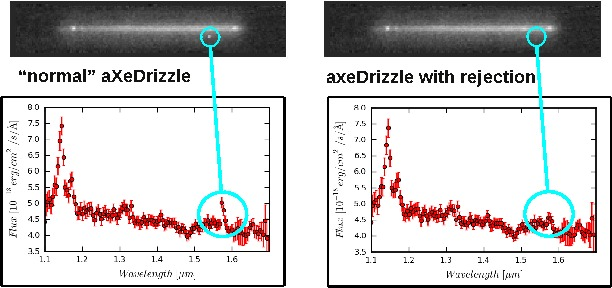
    
   The comparison of a 2D drizzled image (WFC3/G141) produced with the "normal"
   aXedrizzle (left column) and the new aX3drizzle that can reject deviant pixels
   (right column). Hot or cosmic ray affected pixels without a correct flag
   in the data quality array are detected and masked out in the new aXedrizzle.
    

To finally extract the 1D spectrum from the deep 2D spectral image, aXe
uses an (automatically created) adapted configuration file that takes
into account the modified spectrum of the drizzled images (i.e.
orthogonal wavelength and cross-dispersion and the  :math:`A/pixel` and
:math:`arcsec/pixel` scales).

A detailed discussion of the drizzling used in aXe is given in [KUMMEL4]_.

:num:`figure #drizzle-exa2` illustrates the aXedrizzle process for one object.
Panel *a* shows one individual grism image with an object marked. Panel
*b* displays the stamp image for this object out of the grism image.
Panel *c* shows the derived drizzled grism stamp image, and the final
coadded 2D spectrum for this object is given in panel *d*. Panel *d*
shows an image combined from 112 PETs with a total exposure time of 124
ksec. In both panels *b* and *c*, the holes resulting from the
discarded cosmic ray-flagged pixels in this individual exposure are
clearly visible.

For aXe version 2.1 we have extended aXedrizzle, and the new version
offers to detect pixels with deviating values such as MultiDrizzle [KOEKEMOER]_ does
in direct imaging. As is shown in :num:`figure #axe-comparison`, the new
aXedrizzle is able to detect and mask out deviant pixels (right panels),
thus reducing the risk to produce an emission line which is an artifact
(left panels).

The new aXedrizzle can only be applied if the sky background has been subtracted off via global background subtraction (see :ref:`global_background_subtraction`).
This new method of combining the 2D grism stamp images has been developed on the basis of and for WFC3 G102 and G141 data. In principle,
the new aXedrizzle could also be applied to ACS G800L data, however
there exist other methods to reliably detect cosmic rays in these modes
(see :ref:`astrodrizzle`). The new aXedrizzle has certainly the
potential of delivering better and cleaner spectra, as can be seen in
:num:`figure #axe-comparison`. But if the alignment of the images has not
been done properly, the new aXedrizzle can massively mask out good
pixels and thus damage the resulting spectra. The results of the
aXedrizzle with pixel rejection (task axedrizzle with
driz_separate=YES, see :ref:`axedrizzle_tasks`) should only be taken as
valid after a carefully comparison with the spectra from the basic
aXedrizzle process (task axedrizzle with driz\_separate=NO, see
:ref:`axedrizzle_tasks`).

.. _optimal_weighting:

Optimal weighting
-----------------

The use of unequal weights in the 1D extraction of
spectral data can enhance the signal-to-noise ratio of the extracted
spectra. The improvement is achieved by attributing lower weights to
pixels which, due to the larger distance from the spectral trace,
contain only a small fraction of the object flux. The optimal weighting
technique was originally introduced in [HORNE]_, and the basic
equation of the spectral extraction using optimal weights is (see [RODRIGUEZ]_ ):

.. math::
   :label: equation1

   \begin{aligned} 
   f(\lambda) = \frac{\sum_x \left[ f(x, \lambda) - b(x, \lambda)\right]*\frac{p(x,\lambda)}{\sigma(x,\lambda)^2}}{\sum_x \frac{p(x,\lambda)^2}{\sigma(x,\lambda)^2}} 
   \label{opt_noise}
   \end{aligned}

The variables are:

-  :math:`\lambda`: the coordinate in the spectral direction

-  :math:`f(x, \lambda)`: the data value at pixel :math:`(x,\lambda)`

-  :math:`b(x, \lambda)`: the background value at pixel
   :math:`(x,\lambda)`

-  :math:`\sigma(x, \lambda)`: the noise value at pixel
   :math:`(x,\lambda)`

-  :math:`p(x, \lambda)`: the extraction profile at pixel
   :math:`(x,\lambda)`

-  :math:`f(\lambda)`: the extracted data value at :math:`\lambda`

In the original descriptions of optimal weighting, the extraction
profile :math:`p(x, \lambda)` is computed from the object spectrum
itself by e.g. averaging the pixel values in wavelength direction. In
[HORNE]_ optimal weighting (or optimal extraction, as named there)
is even an iterative procedure which, starting from a normal extraction
procedure using equal weights, produces improved results for sky
background, extraction profile and, of course, the extracted spectrum.

In ACS slitless spectroscopy such an approach is not viable since

-  an iterative approach on the sometimes hundreds or even thousands of
   spectra on a slitless image would require too much computing time;

-  the signal-to-noise ratio of the sources is often too low to
   determine an individual extraction profile;

-  the contamination phenomenon does not permit an automatic and
   reliable generation of extraction profiles for all sources.

.. _extr-comp:

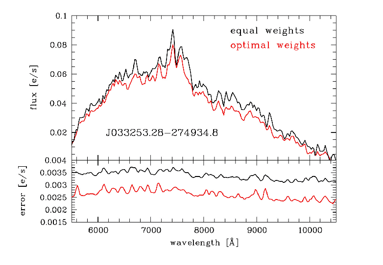
    
    The comparison for an aXe extraction with (red) and without (black) optimal
    weights. The upper panel compares the object flux, the lower panel shows the
    associated errors.

To compute extraction profiles for all sources, the optimal weighting as
implemented in aXe uses the 2D models for the dispersed objects, which
were introduced in :ref:`quantitative_contamination` as the basis of
quantitative contamination. The source-specific models computed there
deliver a perfect basis to calculate the quantity :math:`p(x, \lambda)`
in equation :eq:`equation1`.

The beam models are also used as an input to calculate the pixel errors
:math:`\sigma(x, \lambda)` according to the typical CCD noise model

.. math::
   :label: ccd_noise_model
   
   \begin{aligned}
   \sigma(x, \lambda) = \sqrt{ mod(x, \lambda) + b(x, \lambda) + rdnoise^2}\end{aligned}

with :math:`mod(x, \lambda)` and :math:`rdnoise` the beam model value at
pixel :math:`(x,\lambda)` and the CCD readout noise, respectively.
Computing the quantitative contamination estimate with either the
Gaussian or the Fluxcube emission model is therefore a precondition to
optimal weighting.

In all extraction modes (from individual grism images or from the
combined 2D drizzled grism images) aXe delivers optimal weighted spectra
as an optional addition to the usual, equally weighted ones.:num:`figure #extr-comp`
shows a comparison between two spectra extracted
from the same data using equal and optimal weights. Results from both
observed as well as simulated data indicate that optimal weigthing in
aXe improves the signal-to-noise ratio by a small, but significant
amount as expected according to [HORNE]_ and [ROBERTSON].

.. _ext-widthii:

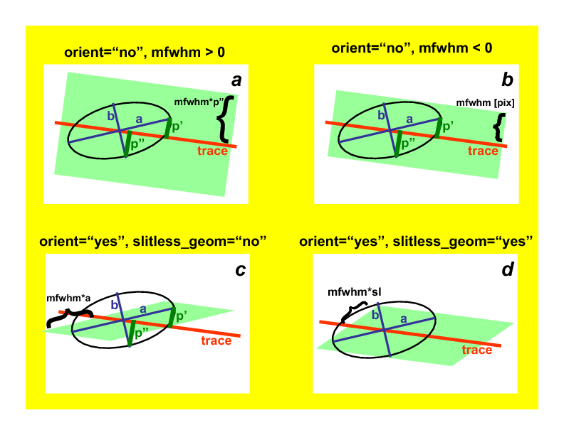
    
    The four different methods to extract 1D spectra: (a) perpendicular to the trace, with 
    an object specific extraction width :math:`mfwhm * M A X(p', p'')` and :math:`p'` and :math:`p''`
    the projection of the major and minor half axis width onto the extraction direction, respectively;
    (b) perpendicular to the trace, with a fixed extraction width :math:`mfwhm` for all objects;
    (c) along the direction of the objects major have axis with extraction width of :math:`mfwhm * a`
    (a= major axis width); (d) a virtual slit with the length sl, widht sw and orientation so as computed
    from the morphological object parameters :math:`(a,b,\sigma)` to extract with the width :math:`mfwhm * sl`
    along so.

.. _extraction_parameters:

Extraction parameters in aXe
----------------------------

aXe offers a large range of possibilities to specify the extraction
width and extraction direction for the individual objects. Before
running aXe, the user has to decide in which way the 1D spectra should
be extracted from the grism images.

Fixed extraction direction or variable extraction direction
~~~~~~~~~~~~~~~~~~~~~~~~~~~~~~~~~~~~~~~~~~~~~~~~~~~~~~~~~~~

With a fixed extraction direction the lines of constant wavelength and
therefore the extraction direction form the angle :math:`90^\circ` with
the trace in all beams of all objects.

With variable extraction, the line of constant wavelength follows for
every object a specific, marked direction. The major axis angle in the
column THETA_IMAGE of the Input Object List is used in this mode to
define the line of constant wavelength or extraction direction for every
object individually. aXe mimics with the variable extraction direction
individually oriented slits for all objects. This can help to maintain
the instrumental resolution for small, extended objects. However for
small angles between the trace and the extraction direction the finite
instrumental resolution limits any improvements due to the variable
extraction direction, and in addition the extraction becomes numerically
unstable. aXe can switch (with the parameter SLITLESS_GEOM=YES,
see below) the extraction direction from the major axis angle to a
different angle which optimizes the resolution of the extracted spectra (see [KUMMEL2]_, [FREUDLING]_).

.. note::
    The optimal choice of extraction strategy depends very much on the scientific
    goals ans the morephology of the observed sources. For stellar sources a fixed extraction 
    direction together with a fixed extraction width is cer- tainly highly recommended. Deep 
    survey type observations definitely need a variable extraction width, since the object 
    sizes usually span a large range which can not be met with a fixed extraction width. In 
    this case the re- sults would also benefit from a variable extraction direction to get 
    the best possible spectral resolution.
    Also in typical survey scenarios the morphological
    description of stellar objects and faint objects close to the detection limit rather 
    reflects the statistical or systematic measurement errors than the true intrinsic object 
    properties. To compensate these doubtful mesurements of the quantities A IMAGE, B IMAGE 
    and THETA IMAGE, aXe applies, with the parameters op- timized for surveys, a default 
    extraction with an extraction direction per- pendicular to the trace angle and a fixed 
    object size to all objects smaller than a threshold given in the configuration file. 
    Setting this threshold to the typical size of point-like objects assures a proper 
    extraction for stellar objects and marginally resolved faint sources.
    
    
.. warning::
    The parameter combination ORIENT=yes and SLITLESS\_GEOM=NO might be resonable in isolated cases, and it's use is not prohibited.
    However aXe delivers a warning in the case that the angle between the extraction direction and the object trace is very small
    (:math:`<1^\circ`). This warning must be seriously taken into account, since a core dump may result during later stages of the aXe
    reduction

Fixed extraction width or object specific extraction width
~~~~~~~~~~~~~~~~~~~~~~~~~~~~~~~~~~~~~~~~~~~~~~~~~~~~~~~~~~

Similar to the choice of extraction direction, aXe offers both a fixed
and a variable extraction width. The fixed extraction width remains
constant for all objects.

The variable extraction width is determined for each object
individually to a scaled value :math:`extrfwhm` of the object extent in
the extraction direction.

The main parameters to specify extraction width and extraction direction
are extrfwhm (or :math:`mfwhm` in :num:`figure #ext-widthii`, orient and
slitless\_geom in the task axecore. :num:`figure #ext-widthii`
illustrates how those parameters can be used to extract the flux of an
object in various ways:

-  in :num:`figure #ext-widthii` a, the flag orient=NO indicates a
   fixed extraction direction of :math:`90^\circ` with respect to the
   trace direction. A value mfwhm > 0 specifies a variable extraction
   width, which in the case orient=NO is
   :math:`width = MAX(p', p'') * mfwhm` pixels on either side of the
   trace (hence :math:`2*width` in total). Here :math:`p'` and
   :math:`p''` are the projection of the major and the minor axis width
   onto the extraction direction.

-  in :num:`figure #ext-widthii` b, the flag orient=NO indicates a
   fixed extraction direction of :math:`90^\circ` with respect to the
   trace direction. A value mfwhm < 0 specifies a fixed extraction of
   :math:`width = mfwhm` pixels on each side of the trace (hence
   :math:`2*mfwhm`\ pix in total).

-  in :num:`figure #ext-widthii` c, the flag orient=YES indicates a
   variable extraction direction. Since slitless\_geom=NO the
   extraction direction must follow the direction of the major axis
   :math:`a`. The extraction width is variable with
   :math:`width = mfwhm * a` pixels on either side of the trace.

-  in :num:`figure #ext-widthii` d, with the flag slitless\_geom=YES an
   individual *virtual slit* with the slit length *sl*, the slit width
   *sw* and the orientation *so* is defined from the major axis size
   A\_IMAGE, the minor axis size B\_IMAGE and the major axis angle
   THETA\_IMAGE given in the Input Object List. :ref:`Appendix A<appendix>`
   gives the equations for computing the virtual
   slit parameters. The shape of the virtual slit optimizes the spectral
   resolution for the extracted spectra and avoids angles too close with
   the trace direction (see and for details). The extraction width is
   then the object specific width :math:`width = mfwhm * sl` along the
   direction *so*.

.. _flux_conversion:

Flux conversion
---------------

The flux conversion is done using sensitivity curves which had been
derived through dedicated observations of flux standard stars ([KUNTSCHNER]_,[LARSON1]_,[LARSON2]_). In
extended objects, however, the spectral resolution is degraded by the
object size in the dispersion direction. aXe can take into account
(parameter adj\_sens=YES in the tasks axecore, axedrizzle, pet2spc) the
degraded spectral resolution of extended sources by smoothing the point
source sensitivity function. Based on the approximation of Gaussian
object shapes, aXe uses a Gaussian smoothing kernel with the width

.. math:: 
    :label: gaussian_width
    
    \sigma_i = f * r * \sqrt{sw_i^2 -  p^2}

with :math:`sw_i` the width of the *virtual slit* of object :math:`i`
(see :ref:`Appendix A<appendix>`), the dispersion :math:`r`, the
point source object width :math:`p` and the correction factor :math:`f`,
which is empirically determined for the various slitless modes. The
adjusted flux conversion has been developed for and applied in the
various data reduction projects within the **H**\ ubble **L**\ egacy
**A**\ rchive (HLA) program [FREUDLING]_.

.. _adj-sens:

.. figure:: images/adj_sens.png
    :align: center
    
    An ACS.WFC G800L slitless spectrum of an extended object
    reduced with (upper panel) and without (lower panel) adjusting the 
    sensitivity curve in the flux conversion. The 'wings' at both wavelength
    ends in the lower panel are a clear sign of the decreased resolution due
    to the object extent.

:num:`figure #adj-sens` shows the effect of the sensitivity adjustment
for an extracted ACS/WFC spectrum. The lower panel shows a strong upturn
at both wavelength ends due to the degraded resolution. Smoothing the
sensitivity function using the appropriate Gaussian kernel suppresses
this effect (upper panel).

aXe Visualization
-----------------

A deep ACS/WFC grism image can contain detectable spectra of hundreds to
thousands of objects, and visual checking of each spectrum is very
tedious. A quick-look facility is highly desirable in order to find
interesting objects (e.g. high redshift galaxies, SN, etc) which can be
highlighted for further study or interactive spectrum extraction. For
this reason aXe2web was developed, a tool which produces browsable web
pages for fast and discerning examination of many hundreds of spectra.

Since aXe2web requires specific python modules, it cannot be included
in the STSDAS software package. It is therefore distributed via the aXe
webpage at in the aXe2html package. 

aXe2web uses a standard aXe input catalogue and the aXe output files
to produce an html summary containing a variety of information for each
spectrum. This includes a reference number, magnitude in the magnitude
system of the direct object, the X and Y position of the direct object,
its Right Ascension and Declination, a cut-out image showing the direct
object, the spectrum stamp image showing the 2D spectrum, a 1D extracted
spectrum in counts and the same in flux units.

The user can set various keywords to influence the html output. For
example, it is possible to sort the objects with respect to an object
property such as magnitude or Right Ascension.

In order to facilitate the navigation within a data set, an overview and
an index page accompany the object pages. The overview page contains for
each object the basic information sequence number, reference number,
X,Y,RA,Dec and magnitude. The index page includes a table with the
ordered reference number of all objects. Direct links, from both the
overview page and the index page, point to the corresponding locations
of the objects in the object pages.

.. _axe-2web:

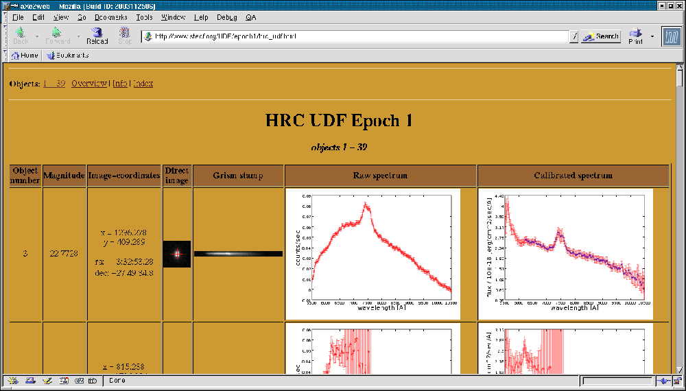
    
    Part of a webpage created by aXe2web. The coadded 2D spectrum of the object
    shown here is displayed in :num:`figure #drizzle-exa2`.
    
    
:num:`figure #axe-2web` is a screenshot taken from Epoch 1 data of the HUDF HRC
Parallels survey and shows the line covering the object whose coadded 2D
spectrum is shown in Fig. [drizzle]d. The web pages created by aXe2web
are located at the preview web pages: http://archive.stsci.edu/prepds/udf/

Acknowledgement
---------------

In publications, please refer to aXe as: **Sosey, M., Pirzkal N., Lee, J. 2013**

