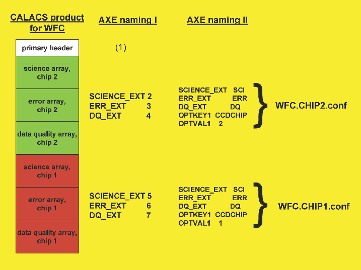

.. _file_formats:

File Formats
============

[FIlesFormat]

This chapter describes the file formats of the intermediate data
products generated by the aXe tasks. All files used by the aXe tasks are
either ASCII files, FITS binary images with multiple extensions, or FITS
binary tables containing multiple extensions. Separate BEAMs are kept by
all aXe tasks in separate FITS extensions.

.. _input_images:

Input Images
------------

[inimage] The input images must be in FITS format. Any FITS file
following the FITS standard with binary image extensions can be used as
input to the aXe tasks. A WCS (CD matrix) should be present in the
header of the FITS extension to be read for some of the aXe tasks to
work properly (sex2gol).

All standard pipeline processed input files are multi extension
fits-files with the science, error and data quality array(s) in various
extensions.

There are two ways to specify a fits extension in an aXe configuration
file. One way is to address the fits extension number. Here aXe follows
the convention of the CFITSIO library, whereby the primary extension
(which is always present) has number 1, the first image extension number
2, the second image number 3 and so on. For an HRC image, the lines

::

    SCIENCE_EXT 2
    ERROR_EXT   3
    DQ_EXT      4

in an aXe configuration file specify which fits extensions to use as
science, error and data quality arrays, respectively. Another way to
specify a fits extension in aXe is to use the extension names. In case
of an HRC image, the lines

::

    SCIENCE_EXT SCI
    ERROR_EXT   ERR
    DQ_EXT      DQ

are equivalent to the ones given before.

An aXe configuration file can target only one science array plus its
associated error and data quality arrays. For ACS/WFC and WFC3/UVIS
images, the data from its two chips is stored in separate extensions. To
fully process these images in aXe two processing runs with two different
configuration files have to be undertaken. With the fits extension
numbers, the extensions can be uniquely specified using the scheme given
above. In case that extension names are used, additional information
must be provided, since there exist e.g. two extensions with the
extension name SCI. In the aXe configuration file this additional
information is the chip number, which is specified using the keywords
OPTKEY1 and OPTVAL1. For ACS/WFC and WFC3/UVIS data, the chip
notation defined by the archive is counterintuitive, since the data from
chip 1 is stored at a higher extension number than chip 2 (see ). To
specify the data from chip 1, in addition to the extension names, the
keywords OPTKEY1 and OPTVAL1 must be set to CCDCHIP and 1,
respectively. For chip 2 data the keyword OPTVAL1 must be set to 2.
Figure [fits:sub:`e`\ xt] clarifies the two naming conventions that can
be used in the aXe configuration files named WFC.CHIP1.conf and
WFC.CHIP2.conf. The configuration files shown in Chapt. [Main
Configuration File] also show how the different extensions in the WFC
must be addressed.

    
.. _fluxcube_file:

Fluxcube file
-------------

[fcube] The fluxcube files are a necessary input to compute a
quantitative contamination extimate with the so called fluxcube emission
model. This model is extensively described in
Chapt. [quant\ :sub:`c`\ ont]. The fluxcube files have the file
extension .FLX.fits (a typical fluxcube name is e.g.
j8mt20kiq\_flt\_2.FLX.fits, which is the fluxcube for the grism image
j8mt20kiq\_flt.fits[sci,1]).

The fluxcube files are generated in the task fcubeprep (see
Chapts. [fcubeprep] and [FPREP]) from MultiDrizzled direct images
covering the area of the grism images. Fluxcubes are multiextension fits
images. The first image extension is a so called Segmentation image. It
shows for each pixel the number of the object to which the pixel belongs
in the emission model of the corresponding grism image. All other
extensions are flux images at different wavelengths. The wavelength of
every flux image is indicated in the name of the fits extension (e.g.
the fits extension j8mt20kiq\_flt\_2.FLX.fits[LAMBDA769] is a flux image
at :math:`769\,nm`).

In the computation of the quantitative contamination with the fluxcube
emission model, a fluxcube file must exist for every grism image
extension. All extensions cover approximately the identical FoV as the
corresponding grism image extension. The keywords XOFFS and YOFFS in the
primary fits header mark the offsets between the pixel coordinates in
the grism image and in the fluxcube.

.. _input_image_list:

Input Image List
----------------

[inlist] The Input Image List is a flexible file format used in the High
Level Tasks (axeprep, axecore, drzprep, axedrizzle) to specify for each
grism image the necessary information for the aXe reduction. The file
format is identical for all High Level Tasks. Once the user has produced
an Input Image List for a particular data set, it can be used in all
High Level Tasks (for the parameter *inlist*). Each row lists a grism
image and the additional filenames and information to reduce the grism
image with aXe.

The columns list:

#. grism image name (mandatory)

#. input object list 1, input object list 2, ... (mandatory)

#. direct image (optional)

#. dmag value (optional)

If the grism image has more than one science extension, the Input Object
List corresponding to each science extension must be specified as comma
separated list in the second column. If the Input Object Lists refer to
a direct image instead of the grism image itself, the name of the grism
image should be listed in the third row. The fourth row holds the
individual dmag value for the grism image (see task gol2af in
Chapt. GOL2AF). The third and fourth columns are optional and can be
omitted. A number in the third row will be interpreted as the
dmag-value.

The following example shows some rows taken from an Input Image List for
a WFC data set.

::

    j8qq50nkq_flt.fits j8qq53nkq_1.cat,j8qq53nkq_2.cat j8qq53nkq_flt.fits 0.2
    j8qq51pmq_flt.fits j8qq54pmq_1.cat,j8qq54pmq_2.cat j8qq54pmq_flt.fits 0.15
    j8qq52ntq_flt.fits j8qq55ntq_1.cat,j8qq55ntq_2.cat j8qq55ntq_flt.fits -0.4
    j8qq10ikq_flt.fits j8qq16ikq_1.cat,j8qq16ikq_2.cat j8qq16ikq_flt.fits 0.0
    j8qq11juq_flt.fits j8qq17juq_1.cat,j8qq17juq_2.cat j8qq17juq_flt.fits 0.05
    j8qq11k0q_flt.fits j8qq18k0q_1.cat,j8qq18k0q_2.cat j8qq18k0q_flt.fits -.5
    j8qq12kgq_flt.fits j8qq19kgq_1.cat,j8qq19kgq_2.cat j8qq19kgq_flt.fits 0.32

.. _input_object_list:

Input Object List
-----------------

:ref:`sex` This file is a simple ASCII file containing tabulated information
about objects to be extracted. It has the same format as a SExtractor
2.x output object catalog. The first few lines contain the name and
description of each of the columns in the tabulated portion of this
file.

To extract the spectra, aXe must know the exact location the objects
would have on the grism/prism image if a filter instead of the
grism/prism would have been used. The aXe task sex2gol uses the Input
Object Lists plus further image information to generate a Grism Object
List, which contains all the necessary grism image coordinates of the
objects.

The Input Object List (IOL) and therefore the SExtractor catalogue they
are built from, must contain the following columns:

::

    NUMBER
    X_IMAGE
    Y_IMAGE
    A_IMAGE
    B_IMAGE
    THETA_IMAGE
    X_WORLD
    Y_WORLD
    A_WORLD
    B_WORLD
    THETA_WORLD
    MAG_AUTO

If the IOL refers directly to the grism/prism image and not to a
direct image taken at a close position (see Chapt. [IOLprep]), the
values in the columns \_WORLD are ignored. They can be replaced by ###,
NaN, -NaN, or +NaN.

To compute a quantitative contamination estimate with the gaussian
emission model presented in Chapt. [quant\ :sub:`c`\ ont], the
wavelength of the magnitude must be known. aXe decodes the wavelength
given in a column name if it is given as:In this notation ? and are
single and multiple characters, respectively. Valid magnitude column
names instead of MAG\_AUTO are therefore e.g. MAG\_F906LP, MAG\_R710JOHN
and MAG\_I763SLOAN. Several magnitude columns with the brightness at
various wavelengths improve the emission model and therefore the
contamination estimate.

Additional columns are ignored and stripped off when generating the
Grism Object List. The actual order of the columns in the Input Object
List is not important as long as the header of the file properly
describes its content. Blank lines and lines starting with a ''' are
ignored.

Care should be taken that each object has a unique number (NUMBER
column) assigned to it in an Input Object List. This is the value that
will be used throughout the extraction process to identify a particular
object. If you use several Input Object Lists in your aXe reduction,
make sure that an individual object has the same number in all Input
Object Lists. This is important for the combination of spectra extracted
from different grism files with axedrizzle.

The object numbers must be positive, but do not have to start at a
particular value and do not need to be in consecutive order.

With the task iolprep, aXe offers a tool to generate the set of Input
Object Lists for standard data sets. This aXe task is described in
Chapt. [IOLP]. An example of its use is provided in Chapt. [IOLprep].

.. _grism_object_list:

Grism Object List
-----------------

::`gol` This file (GOL) is usually generated by aXe using the task
sex2gol. It has exactly the same format as the Input Object List.

.. _aperture_file:

Aperture File
-------------

:ref:`aper` This Aperture File is an ASCII file describing the APERTUREs in
the spectroscopic image. An APERTURE consists of all BEAMS of an object.
A BEAM is defined as the group of pixels in the image which will be
extracted and combined to produce a final 1-D spectrum. APERTUREs are
numbered (e.g. APERTURE 101) using the same numbers that originally
appeared in the NUMBER column of the Input Object List. Each APERTURE
itself consists of one or more BEAMs (labelled A, B, C etc..). Usually,
each object is assigned one aperture in the APER file and each
dispersive order is assigned a different BEAM entry inside that aperture
definition. In this manner, assuming that the first and second orders
are labelled A and B respectively, the 2nd order of object 101 will be
found in APERTURE 101, BEAM B. The aperture file is generated by the
task gol2af.

Each BEAM entry in the APER file contains the following information
(data format is indicated in ):

-  REFPIXEL## the position in the image of a reference pixel [2\*float,
   x,y]

-  CORNERS## the coordinates of a quadrangle defining the region of the
   image containing the pixel of interest [8\*float,
   x1,y1,x2,y2,x3,y3,x4,y4]

-  CURVE## a polynomial description of the dispersion relation of the
   form :math:` {\Delta y} = P({\Delta x}) = a_0+a_1*{\Delta x}+a_2*{\Delta x}^2+...`.
   :math:`\Delta x^n` and :math:`P({\Delta x})` are the pixel offsets as
   measured from the coordinates listed in REFPIXEL. The first number
   following this keyword is the order of the polynomial. It is followed
   by :math:`(n_1)` polynomial parameters :math:`[int, (n+1)\*float]`

-  WIDTH## the total number of pixels to extract in the cross dispersion
   direction [float]

-  ORIENT## the orientation, in degrees counter-clockwise and with
   respect to the x-axis, along which the extraction should proceed
   [float]

-  AWIDTH## the object width as in column A\_IMAGE in the Input Object
   List [float]

-  BWIDTH## the object width as in column B\_IMAGE in the Input Object
   List [float]

-  AORIENT## the object angle as in column THETA\_IMAGE in the Input
   Object List [float]

-  FLUX## the wavelength and the flux values of the object taken from
   the Input Object List
   :math:`[2n*float, \lambda_1, flux_1,\lambda_2, flux_2,...\lambda_n, flux_n]`

-  IGNORE## followed by either 0 or 1. If set to 1, this BEAM will not
   be extracted. [int]

The following example shows one APERTURE containing two BEAMs:

::

    APERTURE 2
      BEAM A
         REFPIXEL2A 27.841 712.643         
         CORNERS2A  32 714 217 568 208 564 23 710
         CURVE2A    1 0.000e+00 -7.893e-01     
         WIDTH2A    2.811                       
         ORIENT2A   28.083                      
         AWIDTH2A   1.385
         BWIDTH2A   0.937  
         AORIENT2A  -61.917   
         FLUX2A     5.55000e+02 4.10993e-20
         IGNORE2A   0                     
      BEAM END
      BEAM B
         REFPIXEL2B 27.841 712.643                       
         CORNERS2B  -122 837 -97 817 -106 812 -131 832
         CURVE2B    1 0.000e+00 -7.893e-01    
         WIDTH2B    2.811         
         ORIENT2B   28.083      
         AWIDTH2B   1.385         
         BWIDTH2B   0.937    
         AORIENT2B  -61.917        
         FLUX2B     5.55000e+02 4.10993e-20 
         IGNORE2B   1 
      BEAM END

.. _background_estimate_file:

Background Estimate File
------------------------

[BEF] This file (BEF) is a multiple extension FITS file containing a
copy of the input slitless data where the regions defined in an Aperture
File have been replaced by estimates of the background (see Chapt.[BE]).
This file contains one primary data array in the main extension, named
SCI, followed by two extensions containing respectively the error
array of the Background Estimate (extension ERR), and the Data Quality
array of the Background Estimate (extension DQ) where bad pixels are
flagged by a non-zero value.

This file is generated by the backest task.

.. _pixel_extraction_table:

Pixel Extraction Table
----------------------

[PET] This file (PET) is a FITS file containing FITS binary table
extensions. The primary extension is empty and its header contains
information from the header of the original FITS data file from which
the PET was generated. Each of these extensions correspond to a single
BEAM (as listed in the Aperture File). Each extension can be accessed
using its name which is ##" (e.g. 1A for the first BEAM of APERTURE
1). Each extension contains the information extracted using the task
af2pet for every pixel contained in the corresponding BEAM. It is in
essence a table listing all the pixels in BEAM and some of the values
computed for each pixel. A description of the geometry involved can be
found in Chapt. [soft description].

This file is generated by the af2pet task (see Chapt.[AF2PET]).

Each extension contains the following columns :

-  N, the number of pixels in this BEAM

-  P\_X, the absolute column coordinate of the pixel

-  P\_Y, the absolute row coordinate of the pixel

-  X, the relative column coordinate of the pixel with respect to the
   BEAM reference pixel (REFPIXEL## in Aperture File)

-  Y, the relative row coordinate of the pixel with respect to the BEAM
   reference pixel (REFPIXEL## in Aperture File)

-  DIST, the projected distance from the center of the pixel to the
   section point on the trace of the spectrum

-  XS, abscissa of the section point relative to the BEAM reference
   pixel (REFPIXEL## in Aperture File)

-  YS, ordinate of the section point relative to the BEAM reference
   pixel (REFPIXEL## in Aperture File)

-  DXS, width of this pixel along the computed trace

-  XI, path length of the section point relative to the BEAM reference
   pixel (REFPIXEL## in Aperture File) along the trace

-  LAMBDA, the average wavelength of the light collected by this pixel

-  DLAMBDA, the wavelength range of the light collected by this pixel

-  COUNT, the number of electron/s in this pixel

-  ERROR, the error estimate in electron/s in this pixel

-  WEIGHT, the extraction weight assigned to this pixel

-  CONTAM, the contamination flag. Set to :math:`-1` if no contamination
   was computed (the task petcont was not run) or to the number of BEAMs
   in which the pixel is included. CONTAM=1 implies that the pixel is a
   member of exactly one BEAM and therefore not contaminated, while
   CONTAM\ :math:`=`\ N implies that the pixel is present in N-1 BEAMs,
   and that contamination may therefore be a problem.

-  MODEL, the signal (electron/s) in this pixel according to the
   quantitative contamination model.

-  DQ, the data quality of this pixel.

The Drizzle Prepare File
------------------------

This file is a multi-extension FITS file containing the stamp images of
all first order beams in a grism image. For each BEAM there are up to
five extensions in the DPP-file:

-  the data stamp image with the extension name “BEAM\_[aperture][beam]
   (e.g. BEAM\_117A)

-  the error stamp image with the extension name ERR\_[aperture][beam]
   (e.g. ERR\_117A)

-  the contamination stamp image with the extension name
   CONT\_[aperture][beam] (e.g. CONT\_117A)

-  the grism model stamp image with the extension name
   MOD\_[aperture][beam] (e.g. MOD\_117A)

-  the variance stamp image with the extension name
   VAR\_[aperture][beam] (e.g. VAR\_117A)

The Drizzle Prepare File is created by the task drzprep. In the task
axedrizzle, the science, error and contamination images are extracted
and drizzled to build for each object the various extensions of a 2D
drizzled grism image.

The 2D Drizzled Grism Image
---------------------------

[mef:sub:`f`\ ile] The 2D drizzled grism images are multi-extension FITS
files created in the task axedrizzle. There exists one 2D drizzled grism
image for every object in the Input Object Lists used to start the aXe
reduction. Its name is [DRZROOT-keyword]\_mef\_ID[object number].fits
(e.g. testaXe\_mef\_ID105.fits) and reflects the object number used in
the Input Object Lists. A 2D drizzled grism image created in axedrizzle
has the extensions:

-  SCI: the science image drizzled from the science extensions of the
   particular object in all DPP files

-  ERR: the error image drizzled from the error extensions of the
   particular object in all DPP files

-  EXPT: the exposure time map for the science extension

-  CON: the contamination image drizzled from the contamination
   extensions of the particular object in all DPP files

-  MOD: the grism model drizzled from the model extensions of the
   particular object in all DPP files

-  VAR: the variance image drizzled from the variance extensions of the
   particular object in all DPP files

-  SCIBCK: the drizzled background image (exists only if background
   drizzling was used)

-  ERRBCK: the error of the drizzled background image (exists only if
   background drizzling was used)

-  WHT: the weight image for the science extension

The weight extension is derived from the exposure time map in the task
drz2pet (see Chapt. [DRZ2PET] on how the weights are computed). In
axedrizzle the task drz2pet is used to generates a PET from the set of
2D grism images and to extract 1D spectra for those drizzle-coadded
PETs.

.. _formats_extracted_spec_file:

Extracted Spectra File
----------------------

[SPC] This file (SPC) is a FITS file containing FITS binary table
extensions. The primary extension is empty and its header contains
information from the header of the original FITS data file from which
the SPC was generated. Each of these extensions correspond to a single
BEAM (as listed in the Aperture File). Each extension can be accessed
using its name which is ’"BEAM\_##" (e.g. ”BEAM\_1A” for the first BEAM
of APERTURE 1).

This file is generated by the pet2spc task. Each extension contains an extracted, binned, spectrum as produce by
the task pet2spc. Each extension contains the following columns :

-  N, the number of rows in this spectrum

-  LAMBDA, wavelength in A

-  TCOUNT, total number of counts in e s\ :math:`^{-1}` in this
   wavelength bin.

-  TERROR, error in the total number of counts in e s\ :math:`^{-1}` in
   this wavelength bin.

-  COUNT, background subtracted number of counts in e s\ :math:`^{-1}`
   in this wavelength bin.

-  ERROR, error in the background subtracted number of counts in e
   s\ :math:`^{-1}` in this wavelength bin.

-  BCOUNT, estimate of the number of counts in electron/s contributed
   from the background in this wavelength bin.

-  BERROR, error in the estimate of the number of counts in e
   s\ :math:`^{-1}` contributed from the background in this wavelength
   bin.

-  FLUX, background subtracted flux in erg cm\ :math:`^{-2}`
   s\ :math:`^{-1}` A\ :math:`^{-1}` in this wavelength bin.

-  FERROR, error in the background subtracted flux in erg
   cm\ :math:`^{-2}` s\ :math:`^{-1}` A\ :math:`^{-1}` in this
   wavelength bin.

-  WEIGHT, number of pixels binned together into this wavelength
   bin.[wcolumn]

-  CONTAM, for quantitative contamination (see
   Chapt. [quant\ :sub:`c`\ ont]) this column gives an estimate on the
   contaminating flux from other objects to the spectrum. For
   geometrical contamination the values are set to -1,0,1..n to give the
   number of source this bin is contaminated with. The value 0 means no
   contamination. If the contamination was not recovered, every bin has
   the value -1.

-  DQ, the propagated data quality at this wavelength. This is computed
   by simply summing all the individual DQ values from the pixels
   contributing to this wavelength.

Stamp Image File
----------------

[STP] This file (STP) is a multi-extension FITS file containing stamp
images of the BEAMs that were extracted. The primary extension of this
file is empty. Each following extension contains the image of a single
extracted BEAM. Extensions are named BEAM\_[aperture][beam] (e.g.
BEAM\_1A). The STP-file is similar to the drizzled grism image explained
in Chapt. [mef\ :sub:`f`\ ile]. The STP-file contains all stamp images
in a slitless image, and the drizzled grism image the stamp image of one
object as combined from all slitless images. Also the drizzled grism
images all have a WCS in wavelength and spatial direction.

Weight Image File
-----------------

[WHT] The weight image file is produced in the optimal weighted
extraction of spectra from individual grism images. Its file name
extension is \_opt.WHT.fits, corresponding to the \_opt.SPC.fits of the
optimal extracted spectra file.

The weight image file is a multi extension fits file which contains
images of the weights applied to the PET pixels during the optimal
weighted extraction. The weights are computed acording to
Eqn. [opt\ :sub:`n`\ oise] in Chapt. [optimal weighting]. The weight
images have trace length and trace distance as x- and y-axes,
respectively. The extensions are named WHT\_[aperture][beam] (e.g.
WHT\_1A).

Contamination File
------------------

[CONT] This file (CONT) is a simple FITS image containing the
contamination estimate computed by the petcont task.

If quantitative contamination (see Chapt. [quant\ :sub:`c`\ ont]) was
deployed, the contamination image contains the sum of all modelled
beams. It is therefore a complete, quantitative model of the
corresponding grism/prism image. Blinking the contamination image
against the slitless image is a very good method to check whether the
contaimation estimates are reasonable. The contamination image should
have pixel values comparable to the background subtracted slitless
image.

In geometrical contamination, pixels which are not within any known
beams are assigned a value of 0. Pixels which are within a single beam
(i.e. not contaminated by higher spectral orders and/or other objects in
the field) are assigned a value of 1. Pixels contaminated by n beams are
given a value of n+1.

