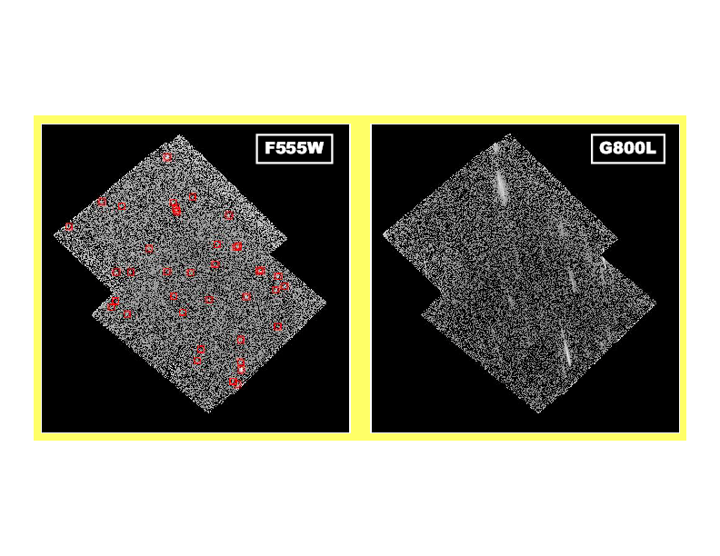
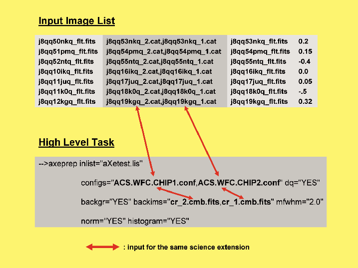

Using hstaxe
============

This chapter gives a step-by-step approach on how an aXe
reduction on a given data set is performed. A short introduction to the
input data is followed by an explanation of the few preparatory steps
that are necessary to generate all input files. Then the different
methods to produce the final, calibrated 1D spectra are shown and
discussed. Both the sequence of commands within PyRAF as well as small
example scripts are given for all reduction branches.

The input data
--------------

The input data consist of four direct images and eight grism
images. All images were taken with the High Resolution Camera of the
ACS. The direct images taken with the F555W filter are

::

    j8m81cd9q_flt.fits
    j8m824toq_flt.fits
    j8m84aqkq_flt.fits
    j8m851tmq_flt.fits

The dispersed images observed with the G800L grism are:

::

    j8m820leq_flt.fits
    j8m820llq_flt.fits
    j8m820lrq_flt.fits
    j8m820m4q_flt.fits
    j8m822q0q_flt.fits
    j8m822q4q_flt.fits
    j8m822qbq_flt.fits
    j8m822qhq_flt.fits

The data set presented here is in the HST archive. It has been taken as
part of the ACS/HRC Parallels program to the ACS Ultra Deep Field.
Moreover these images are also part of the test data for grism
observations (see :ref:`validating_the_axe_install`).

.. warning:: Spectral extraction from MultiDrizzled grism/prism images:
    While MultiDrizzle can combine slitless grism/prism images, no wavelength sensative flatfield
    is applied to the images (see :ref:`calibration_flat_field`). Moreover, the field
    dependence of the grism/prism spectra and the field dependent wavelength calibration
    are not taken into account in the combination process. It is therefore not recommended to extract
    the spectra directly from the Multidrizzle combined images. The images are however very useful for field
    examination.
    
    
Preparing the extraction
------------------------

This reduction step collects all necessary input files for the spectral
extraction. In this process the external programs SExtractor [BERTIN]
and Astrodrizzle (part of the drizzlepac package) are
involved. For those programs outside of aXe we do not give a detailed
discussion on their usage or the exact parameter settings, but rather a
description of the purpose and what the program should deliver.

.. _astrodrizzle:

MultiDrizzle
~~~~~~~~~~~~

The first step is to run MultiDrizzle on both the set of direct images
and the set of grism/prism images. MultiDrizzle is an interface for
performing all the tasks necessary for registering dithered HST images.
The program automatically performs cosmic ray rejection, removes
geometric distortions and performs the final image combination with
drizzle.

The grism/prism image combination is done for two reasons:

#. the combined image gives a good impression on the quality of the data
   and the signal-to-noise level of the various object spectra

#. MultiDrizzle runs a cosmic ray detection algorithm, and the
   dq-extention of the flt-images is updated with the information on all
   cosmic rays detected in the MultiDrizzle run. Running MultiDrizzle is
   therefore a convenient way to perform a cosmic ray detection on the
   grism/prism images.

The combined direct image will be used to create a master catalogue with
SExtractor. The master catalogue will then be projected back (see :ref:`iolprep`) 
to generate Input Object Lists for each image in the MultiDrizzle combination to be used in the 
aXe reduction. :num:`figure #drizz-images` shows an example of a combined direct image (left) and a combined grism image (right).

.. _drizz-images:

    
    The MultiDrizzle combined direct image (left) and the corresponding
    grism image(right). Objects identified in SExtractor are marked with
    red boxes on the firect image. 
    

It is also possible to use other programs to identify cosmic ray hits
on the grism/prism images. Then the information on the cosmics must be
transported into the dq-extension of the corresponding flt-image. aXe
can exclude flagged pixels in the dq-extention from the reduction. In
the dq-extention, cosmic ray affected pixels should be marked by adding
the appropriate dq-flag 4096 (see ACS Data handbook) to the original dq
value.

For grism images it is favourable (see :ref:`iolprep`) to combine the
direct and the grism images such that the final, MultiDrizzled images
have the same coordinate system. This means that each pixel
:math:`(x,y)` represents the same position :math:`(ra, dec)` on the sky
on both the combined direct as well as the combined grism image. The
user can control this by e.g. specifying the identical center position
and image size in the MultiDrizzle runs. The images in :num:`figure #drizz-images` fulfill this condition.

.. _master_catalogue:

Master catalogue
~~~~~~~~~~~~~~~~

The next step then is to create the master catalogue by running
SExtractor on the combined direct image. Care should be taken when
choosing the SExtractor parameters. Objects which are not in the master
catalogue will later not be extracted from the grism images. Large
numbers of fake objects or cosmics in the master catalogue on the other
hand increase the computation time and simulate contributions to the
contamination of real objects.

The master catalogue must contain all columns which are necessary for
the spectral extraction with aXe (see the format description in
†). The first few lines of the master catalogue
**f555w\_drz.cat** extracted from the direct image in
:num:`figure #drizz-images` are:

::

    #   1 NUMBER          Running object number
    #   2 X_IMAGE         Object position along x                         [pixel]
    #   3 Y_IMAGE         Object position along y                         [pixel]
    #   4 X_WORLD         Barycenter position along world x axis          [deg]
    #   5 Y_WORLD         Barycenter position along world y axis          [deg]
    #   6 A_IMAGE         Profile RMS along major axis                    [pixel]
    #   7 B_IMAGE         Profile RMS along minor axis                    [pixel]
    #   8 THETA_IMAGE     Position angle (CCW/x)                          [deg]
    #   9 A_WORLD         Profile RMS along major axis (world units)      [deg]
    #  10 B_WORLD         Profile RMS along minor axis (world units)      [deg]
    #  11 THETA_WORLD     Position angle (CCW/world-x)                    [deg]
    #  12 MAG_F555W       Kron-like elliptical aperture magnitude         [mag]
     1 2116.6 815.9 5.322e+01 -2.781e+01 14.669 3.407 -79.3 1.0e-04 2.5e-05 -45.4 23.0
     2 1463.7 740.1 5.322e+01 -2.781e+01  1.981 1.355 -84.5 1.3e-05 9.4e-06 -42.8 26.1
     3  850.8 752.1 5.321e+01 -2.782e+01  1.877 1.749  21.9 1.2e-05 1.2e-05  37.9 24.6
     4 1999.1 735.0 5.322e+01 -2.781e+01  0.952 0.465 -52.7 6.0e-06 4.1e-06 -67.4 28.0
     5  760.5 761.5 5.321e+01 -2.782e+01  2.268 1.375 -54.4 1.4e-05 1.0e-05 -65.2 26.2
     6  969.0 826.9 5.322e+01 -2.782e+01  3.863 1.672  37.6 2.4e-05 1.5e-05  22.2 25.0
     7  781.3 831.3 5.322e+01 -2.782e+01  4.455 2.084 -58.9 2.9e-05 1.7e-05 -59.9 25.5
     8  976.5 826.2 5.322e+01 -2.782e+01  2.410 0.839 -86.7 1.6e-05 5.7e-06 -41.6 26.3
     9 1231.5 836.1 5.322e+01 -2.781e+01  2.522 1.177 -65.9 1.6e-05 9.3e-06 -53.8 25.9
    10  981.5 834.9 5.322e+01 -2.782e+01  2.467 1.151  28.3 1.6e-05 9.5e-06  32.7 26.6

In the master catalogue the original column name MAG\_AUTO was changed
to MAG\_F555W, a column name format which indicates the filter
wavelength (:math:`\lambda=555.0`\ nm, see Chapt. ). This format
allows a quantitative contamination estimate with the Gaussian emission
model and the computation of optimal weights.

.. _iolprep:

Preparing the Input Object Lists
~~~~~~~~~~~~~~~~~~~~~~~~~~~~~~~~

Following user requests we have developed and introduced with
aXe-1.5 the task iolprep (see Chapt. [IOLP]), a program to automatically
generate Input Object Lists in a standard scenario such as described
here.

The task iolprep searches in the header of a MultiDrizzle-combined image
for the names and drizzle parameters of all input images. For each input
image, the pixel coordinates :math:`(x_{comb},y_{comb})` of all objects
in the master catalogue, which is associated with the
MultiDrizzle-combined image, are projected out into the coordinate
system of the input image to derive the pixel coordinates
:math:`(x_{input,i},y_{input,i})` therein. For each input image an Input
Object List is generated which comprises all objects which fall on the
area covered by the input image. For the projections of the object
positions, this aXe task uses the STSDAS task tran.

There are two general strategies to apply iolprep:

1. Creating IOL’s for direct images
'''''''''''''''''''''''''''''''''''

[case:sub:`1`] It is always (for grism and prism data) possible to apply
iolprep with the direct image as the MultiDrizzle-combined image and the
master catalogue derived from it. On a data set as described in
Chapt. [indata], the following IOL’s would be produced:

::

    j8m81cd9q_flt_1.cat, j8m824toq_flt_1.cat,
    j8m84aqkq_flt_1.cat, j8m851tmq_flt_1.cat.

As the file names suggest, the IOL’s refer to the direct images, and
during the spectral extraction a direct image **must** be given for
every grism image (see Chapt. [inlist]).

2. Creating IOL’s for grism images
''''''''''''''''''''''''''''''''''

[case:sub:`2`] If in the case of grism data MultiDrizzle was run such
that the combined direct and grism image have the same coordinate system
(see Chapt. [MultiDrizzle]), the object positions in the master
catalogue are also valid for the combined grism image. It is then
possible to apply iolprep with the grism image as the
MultiDrizzle-combined image. In this case the IOL’s refer to the input
grism images and would be named:

::

    j8m820leq_flt_1.cat, j8m820llq_flt_1.cat,
    j8m820lrq_flt_1.cat, j8m820m4q_flt_1.cat,
    j8m822q0q_flt_1.cat, j8m822q4q_flt_1.cat,
    j8m822qbq_flt_1.cat, j8m822qhq_flt_1.cat.

In this scenario the IOL’s refer directly to the grism images, as
their file names indicate, and in the spectral extraction no direct
image is needed.

The latter strategy has small advantages, such as it is easier to make
the Input Image List (see below). It is possible to include objects in
the Input Object List which have positions outside of the area covered
by the corresponding direct image or grism image. In the case that the
spectrum of the object falls partly on the grism image, but its
reference point is outside, the spectrum covered by the grism image can
still be reduced and contribute to the coadded spectrum of the object.
Also higher orders of bright objects outside of the grism image can
cause significant contamination on the grism images. Including them in
the IOL means that their contamination is properly recorded and
evaluated, even if no spectrum is extracted. The parameter
dimension\_info controls the effective area for the inclusion of objects
in the task iolprep.

Depending on whether iolprep is run on the direct image f555w\_drz.fits
or the grism image g800l\_drz.fits, the task is executed as:

::

    -->iolprep mdrizzle_image='f555w_drz.fits' input_cat='f555w_drz.cat'
    dimension_info=0,0,0,0

or alternatively:

::

    -->iolprep mdrizzle_image='g800l_drz.fits' input_cat='f555w_drz.cat'
    dimension_info=0,0,0,0

Preparing the fluxcube files
~~~~~~~~~~~~~~~~~~~~~~~~~~~~

[fcubeprep] For grism images it is possible to apply the fluxcube
emission model (see Chapt. [quant\ :sub:`c`\ ont]) in the estimation of
quantitative contamination. This requires the preparation of a fluxcube
file for every grism image which is analyzed in aXe. For this purpose
the task fcubeprep was developed.

Similar to iolprep, the task fcubeprep (see Chapt. [FPREP]) uses
MultiDrizzled direct and grism images to build the fluxcube files. In
addition, the SExtractor segmentation image which is associated to the
master catalogue must also be provided. fcubeprep searches in the header
of the MultiDrizzle-combined grism image for the names and drizzle
parameters of all input grism images. Using the information on
wavelength and zeropoints which are part of the input, the task
transforms the direct images to flux units. Then the segmentation image
and all direct flux images are projected into the coordinates of each
input grism image to generate cutout images which match the area of the
input grism images. For each input grism image, a fluxcube image is
finally created from the corresponding segmentation and flux cutout
images.

All images used in the input (MultiDrizzle-combined grism image,
MultiDrizzle-combined direct images and segmentation images) **must**
have been combined such that they have the same coordinate system. This
means each pixel :math:`(x,y)` must represent the same position
:math:`(ra, dec)` on the sky on all input images (see
Chapt. [MultiDrizzle]).

In case there are several MultiDrizzle-combined direct images in
different filters available, the user must prepare a file and give for
each image the name, central wavelength and zero point separated by ’,’
in a row. Provided that in addition to the direct image
**f555w\_drz.fits**, there exists also the image **f606w\_drz.fits**,
this file (name **dir\_ims.lis**) looks like:

::

    f555w_drz.fits, 431.8, 25.157
    f606w_drz.fits, 591.8, 26.655

Note that instead of the ’nominal’ values 555 and 606 the more accurate
pivot wavelength values have been used for the ACS filters F555W and
F606W. With the segmentation image **f555w\_seg.fits** the task fcuberep
is executed as:

::

    --> fcubeprep grism_image='g800l_drz.fits' segm_image='f555w_seg.fits'
    filter_info='dir_ims.lis' AB_zero='yes' dimension_info=0,0,0,0

The task creates the fluxcubes:

::

    j8m820leq_flt_2.FLX.fits, j8m820llq_flt_2.FLX.fits,
    j8m820lrq_flt_2.FLX.fits, j8m820m4q_flt_2.FLX.fits,
    j8m822q0q_flt_2.FLX.fits, j8m822q4q_flt_2.FLX.fits, 
    j8m822qbq_flt_2.FLX.fits, j8m822qhq_flt_2.FLX.fits.

Extracting spectra
------------------

Reduction Strategy
~~~~~~~~~~~~~~~~~~

[reduction strategy] Before actually preparing and performing the data
reduction, the user must decide which data reduction strategy to follow.

The main decisions are whether aXedrizzle is used or not and whether the
background subtraction is done globally with the master background or
with a local background for each beam (see Chapt.  [skyback] for a
comparison of the two methods).

aXedrizzle is currently not supported for prism data. Global background
subtraction requires a master background for the instrumental
configuration with which the data were taken with. The available master
background images are posted on the instrument pages (
http://www.stsci.edu/hst/acs/analysis/STECF and
http://www.stsci.edu/hst/wfc3/analysis/grism\ :sub:`o`\ bs/), and users
are urged to check whether a master background is available for their
data.

If possible, the recommended reduction strategy is to do a global
background subtraction and to use aXedrizzle. For the typical survey
type data, this is the best way to reduce ACS grism data (see e.g. the
GRAPES data paper, Pirzkal et al., 2004) or WFC3 grism data. In case
only individual spectra in crowded fields are to be reduced, the
reduction with a background PET may have advantages.

Depending on the reduction strategy, different High Level aXe Tasks (see
Fig. [fig\ :sub:`t`\ asklist]) have to be applied to reduce the spectra.
Table [taskseq] lists the tasks and the order in which to apply them for
the various reduction strategies.

| cllll & +aXedrizzle/& -aXedrizzle/& +aXedrizzle/ & -aXedrizzle/
| [-1.5ex]number & +master sky & +master sky & -master sky & -master sky
| 1. & axeprep & axeprep & axeprep & axeprep
| 2. & axecore & axecore & axecore & axecore
| 3. & drzprep & & drzprep &
| 4. & axedrizzle & & axedrizzle &

    
    
Input Image List
~~~~~~~~~~~~~~~~

The Input Image List is consistently used as the parameter inlist in
all High Level Tasks. The Input Image List defines the combinations of
Input Object Lists, grism images and, if necessary, direct images used
in the spectral extraction.

In case that the IOL’s refer directly to the grism images (see item 1.
in Chapt. [case\ :sub:`1`]), the Input Image List axeprep.lis for the
data presented here looks like:

::

    j8m820leq_flt.fits j8m820leq_flt_1.cat 0.0
    j8m820llq_flt.fits j8m820llq_flt_1.cat 0.0
    j8m820lrq_flt.fits j8m820lrq_flt_1.cat 0.0
    j8m820m4q_flt.fits j8m820m4q_flt_1.cat 0.0
    j8m822q0q_flt.fits j8m822q0q_flt_1.cat 0.0
    j8m822q4q_flt.fits j8m822q4q_flt_1.cat 0.0
    j8m822qbq_flt.fits j8m822qbq_flt_1.cat 0.0
    j8m822qhq_flt.fits j8m822qhq_flt_1.cat 0.0

If the IOL’s refer to direct images, (see item 2. in
Chapt. [case\ :sub:`1`]), the Input Image List axeprep.lis for the data
presented in here looks like:

::

    j8m820leq_flt.fits j8m84aqkq_flt.cat j8m84aqkq_flt.fits  0.0
    j8m820llq_flt.fits j8m81cd9q_flt.cat j8m81cd9q_flt.fits  0.0
    j8m820lrq_flt.fits j8m81cd9q_flt.cat j8m81cd9q_flt.fits  0.0
    j8m820m4q_flt.fits j8m84aqkq_flt.cat j8m84aqkq_flt.fits  0.0
    j8m822q0q_flt.fits j8m851tmq_flt.cat j8m851tmq_flt.fits  0.0
    j8m822q4q_flt.fits j8m824toq_flt.cat j8m824toq_flt.fits  0.0
    j8m822qbq_flt.fits j8m824toq_flt.cat j8m824toq_flt.fits  0.0
    j8m822qhq_flt.fits j8m851tmq_flt.cat j8m851tmq_flt.fits  0.0

Every grism image is paired with the direct image taken at the closest
position on the sky to provide the best overlap between objects in the
IOL and the area covered by the grism image. The dmag-values are all set
to the default :math:`0.0`, and therefore could be neglected here.

The exact format of the Input Image List is extensively described in
Chapt. [inlist]. All files are expected to be located in the directory
indicated by the environment variable AXE\_IMAGE\_PATH (see Chapt. [Env
Var]).

    
    The input image list aXetest.lis and a high level aX3 task.
    The arrows connect input which refers to the identical science extension

The aXe Configuration Files
~~~~~~~~~~~~~~~~~~~~~~~~~~~

[Main Configuration File] The aXe configuration file describes the
imprint of the spectrograph on the detector and contains essential
parameters such as the desription of the spectral trace and the
dispersion solution together with their variations over the Field of
View.

Up-to-date configuration files and the calibration files for all
spectral modes are posted on the instrument pages (
http://www.stsci.edu/hst/acs/analysis/STECF and
http://www.stsci.edu/hst/wfc3/analysis/grism\ :sub:`o`\ bs/). The
appropriate configuration file for the data presented in this Chapter is
given below. To save space the descriptions of the higher order beams
are neglected.

::

    INSTRUMENT ACS
    CAMERA HRC

    # Calibrations for ACS HRC for Cycle 11 onward; released June 2004 
    # based on calibration data taken during SMOV and Cycle 11. 
    # Revised (3rd order) flat field cube:  
    #   ACS.HRC.flat.cube.2.fits
    #
    # Revised 1st and 2nd order sensitivity
    # New 0th order dispersion solution and sensitivity  
    # New -1st order dispersion solution and sensitivity
    # March 2009 (MK): keywords 'POBJSIZE' 'SMFACTOR' with dummy values added

    SCIENCE_EXT SCI ; Science extension
    DQ_EXT DQ       ; DQ extension
    ERRORS_EXT ERR  ; Error extension
    FFNAME ACS.HRC.flat.cube.2.fits
    DQMASK      16383

    EXPTIME EXPTIME
    RDNOISE 4.71
    POBJSIZE 1.0
    SMFACTOR 1.0

    DRZRESOLA  24.0
    DRZSCALE  0.028
    DRZLAMB0  4785.0
    DRZXINI   15.0
    DRZROOT   aXedrizzle

    # PSF variations for optimal extraction
    PSFCOEFFS 8.20 -8.29e-02 4.01e-04 -9.47e-07 1.18e-09 -7.44e-13 1.87e-16
    PSFRANGE 100.0 1100.0

    # First order (BEAM A)
    BEAMA 0 185 
    MMAG_EXTRACT_A 25
    MMAG_MARK_A 27
    # Trace description, 1st order
    DYDX_ORDER_A 1 
    DYDX_A_0 0.0 0.0 0.0 0.0 0.0 0.0
    DYDX_A_1 -0.796319 7.10246e-6 9.55948e-6
    # X and Y Offsets
    XOFF_A 0. 0. 0.
    YOFF_A -1.78463 -0.000149007 0.000436432 
    # Dispersion solution, 2nd order
    DISP_ORDER_A 2
    DLDP_A_0 4783.55 0.00657371 -0.0126691
    DLDP_A_1 23.5107 -0.000677401 0.00127958
    DLDP_A_2 0.00170758 1.77847e-7 1.97777e-7
    #
    SENSITIVITY_A ACS.HRC.1st.sens.2.fits

Under normal circumstances the user can apply the aXe configuration
files without any modifications. Only to speed up the computation time
it might be convenient to modify some keywords (see
Chapt. [time\ :sub:`r`\ equirements]). The location of the configuration
and calibration files is the directory indicated by the environment
variable AXE\_CONFIG\_PATH (see Chapt. [Env Var]).

[] |image|

The ACS Wide Field Camera and the WFC3 UVIS Camera contain two CCD
chips, and the data is stored in two independent extensions of the fits
file. The spectral reduction in aXe is done independently, using one
configuration file for every science extension. In the ACS/WFC and
WFC3/UVIS configuration files, the chip number is specified in the
keywords “OPTKEY1” and “OPTVAL1”.

For technical reasons in both cameras the data of CCD chip No. 1 are
stored in the **second** science extension version ( in PyRAF-fits
notation), and the data of of CCD chip No. 2 is stored in the **first**
science extension version ( in PyRAF-fits notation). Care must be taken
to combine the correct files in the aXe input parameters, since the file
names are often derived from these two counter-intuitive numbering
schemes. While the file names of the configuration files follow the chip
numbers (e.g. ACS.WFC.CHIP1.Cycle13.2.conf and
ACS.WFC.CHIP2.Cycle13.2.conf are the configuration files for chip 1 and
2, respectively), the IOL’s created in iolprep follow the extension
version number (the Input Object Lists j8m822qhq\_flt\_1.cat and
j8m822qhq\_flt\_2.cat contain objects located on the fits image
j8m822qhq\_flt.fits[sci,1] and j8m822qhq\_flt.fits[sci,2],
respectively). Figure [inputext] and the note on page give further
examples how to combine the input for ACS/WFC data in the various High
Level Tasks.

Example reductions for the different scenarios
~~~~~~~~~~~~~~~~~~~~~~~~~~~~~~~~~~~~~~~~~~~~~~

For the remainder of this section we present and describe sequences of
High Level Tasks to reduce data according to the different strategies
outlined in Chapt. [reduction strategy]. The High Level Tasks are listed
with the correct syntax to be executed within an interactive PyRAF
session.

aXedrizzle and Global Sky Subtraction
'''''''''''''''''''''''''''''''''''''

In this reduction scenario the background is subtracted using the
mastersky HRC.back.fits . For each object the 2D spectra on the
individual grism images are combined to a deep, 2D grism spectrum with
aXedrizzle, then the 1D spectrum is extracted from the coadded 2D grism
spectrum. The quantitative contamination with the fluxcube emission
model is chosen. This assumes that the fluxcube files were created
beforehand (see Chapt. [fcubeprep]).

As in all further examples, optimal extraction is selected in the
parameters. In aXe the optimal extracted spectra are always delivered
**in addition** to the normal, equally weighted results. There is **no**
need to run aXe twice, the optimal extractions only entails but a small
additional amount of computing time.

The sequence of commands interactively applied in PyRAF is:

::

    -->axeprep inlist="axeprep.lis" configs="ACS.HRC.Cycle11.2.conf"
               backims="HRC.back.fits" backgr="YES" fwhm="2.0"
               norm="YES" histogram="YES"
    -->axecore inlist="axeprep.lis" configs="ACS.HRC.Cycle11.2.conf"
               back="NO" extrfwhm=4.0 drzfwhm=3.0
               backfwhm=0.0 slitless_geom="YES" orient="YES" exclude="NO"
               lambda_mark=800.0 cont_model="fluxcube" model_scale=3.0
               inter_type="linear" lambda_psf=555.0 spectr="NO"
               weights="NO" sampling="drizzle"
    -->drzprep inlist="axeprep.lis" configs="ACS.HRC.Cycle11.2.conf"
               opt_extr="YES" back="NO"
    -->axedrizzle inlist="axeprep.lis" configs="ACS.HRC.Cycle11.2.conf"
                  infwhm=4.0 outfwhm=3.0 back="NO" makespc="YES"
                  adj_sens="YES" opt_extr="YES"

The line breaks are added here for clarity, but on the actual command
line each command should be given as one string. The most convenient way
to specify the task parameters is with the PyRAF/IRAF epar mechanism.

No aXedrizzle and Global Sky Subtraction
''''''''''''''''''''''''''''''''''''''''

Here the background is globally subtracted using master sky images. The
coaddition of the individual 2D spectra with aXedrizzle is not done.
Gaussian contamination has been chosen. The command sequence is a subset
of the command sequence in the last example, with small differences in
the parameters:

::

    -->axeprep inlist="axeprep.lis" configs="ACS.HRC.Cycle11.2.conf"
               backims="HRC.back.fits" backgr="YES" fwhm="2.0"
               norm="YES" histogram="YES"
    -->axecore inlist="axeprep.lis" configs="ACS.HRC.Cycle11.2.conf"
               back="NO" extrfwhm=3.0 drzfwhm=0.0
               backfwhm=0.0 slitless_geom="YES" orient="YES" exclude="NO"
               lambda_mark=800.0 cont_model="gauss" model_scale=3.0
               inter_type="linear" lambda_psf=555.0 spectr="YES"
               adj_sens="YES" weights="YES" sampling="drizzle"

aXedrizzle and Background PET
'''''''''''''''''''''''''''''

Here the background PETs are generated from background images which have
interpolated pixel values at the beam positions. Both the image as well
as the background are drizzled to deep 2D grism and background images,
respectively (see Chapt. [backspec]).

::

    -->axeprep inlist="axeprep.lis" configs="ACS.HRC.Cycle11.2.conf"
               backgr="NO" fwhm="2.0"
               norm="YES" histogram="YES"
    -->axecore inlist="axeprep.lis" configs="ACS.HRC.Cycle11.2.conf"
               back="YES" extrfwhm=4.0 drzfwhm=3.0
               backfwhm=4.0 slitless_geom="YES" orient="YES" exclude="NO"
               lambda_mark=800.0 cont_model="fluxcube" model_scale=3.0
               inter_type="linear" lambda_psf=555.0 spectr="NO"
               adj_sens="NO weights="NO" sampling="drizzle"
    -->drzprep inlist="axeprep.lis" configs="ACS.HRC.Cycle11.2.conf"
               opt_extr="YES" back="YES"
    -->axedrizzle inlist="axeprep.lis" configs="ACS.HRC.Cycle11.2.conf"
                  infwhm=4.0 outfwhm=3.0 back="YES" makespc="YES"
                  opt_extr="YES"

No aXedrizzle and Background PET
''''''''''''''''''''''''''''''''

Both object and background spectra are extracted from each grism image
individually. The background subtraction is done by subtracting the
background PET from the object PET pixel by pixel. The command sequence
is a subset of the command sequence given in the last example:

::

    -->axeprep inlist="axeprep.lis" configs="ACS.HRC.Cycle11.2.conf"
               backgr="NO" fwhm="2.0"
               norm="YES" histogram="YES"
    -->axecore inlist="axeprep.lis" configs="ACS.HRC.Cycle11.2.conf"
               back="YES" extrfwhm=3.0 drzfwhm=0.0
               backfwhm=0.0 slitless_geom="YES" orient="YES" exclude="NO"
               lambda_mark=800.0 cont_model="gauss" model_scale=3.0
               inter_type="linear" lambda_psf=555.0 spectr="YES"
               adj_sens="YES" weights="YES" sampling="drizzle"

The requirements
----------------

[time:sub:`r`\ equirements] The aXe tasks are rather expensive in terms
of computer time. Some of the main factors contributing to a large
computational need are:

-  the complete error propagation and the propagation of contamination
   information multiplies the computing effort per science pixel by a
   factor of :math:`\sim 3`, since errors as well as contamination are
   stored and treated similar to the science data;

-  the necessary conversions of data format (image, PET, DPP, drizzled
   image) result in a high demand on input/output.

As a rule of thumb, each High Level Task needs around 0.3 sec of
computing time per object and image on a typical Pentium five machine
(:math:`2.3`\ GHz). For prism data with typically a few objects per
image an aXe reduction is completed within a short period of time. In a
survey type project, however, a typical data set consists of 10 ACS/WFC
images and 1000 objects on each image. This results in around half a day
of pure computing time. The minimum RAM requirement is around 2000 MB,
which should not constitute a bottleneck on modern workstations.

Tuning tips
-----------

[tuning] Especially for deep grism data, the computation time can be
quite large, and users would like to speed up the processing time. There
exist some measures to get the results more quickly.

Wavelength dependence of the PSF
~~~~~~~~~~~~~~~~~~~~~~~~~~~~~~~~

For the ACS slitless modes, we have determined the dependency of the
Point Spread Function (PSF) as a function of wavelength, and this
dependency is used (via the configuration keywords PSFCOEFFS and
PSFRANGE) when computing the Gaussian contamination. In general,
computing the Gaussian contamination consumes a lot of processor time,
especially when the wavelength dependence of the PSF is taken into
account.

The aXe reduction on a particular data set is usually done several times
with some small changes in the parameters to fine tune the results. The
wavelength dependence of the PSF is not very large. Switching it off in
the early reductions can save a lot of time without any significant
influence on the results and their interpretations for the next runs.

To neglect the wavelength dependence, the keywords PSFCOEFFS and
PSFRANGE must be commented out in the aXe configuration file (see
Chapt.[Main Configuration File]).

For the WFC3/IR grism we were unable to detect a significant variation
of the PSF with wavelength, hence there are no corresponding keywords
(PSFCOEFFS and PSFRANGE) in the configuration files and aXe is always
running in the “fast” mode.

Extraction of higher grism orders
~~~~~~~~~~~~~~~~~~~~~~~~~~~~~~~~~

The sensitivity of the higher grism orders (0th, 2nd, 3rd, -1st, -2nd)
is typically (not WFC3 UVIS) very low compared to the first order. Most
of the objects on a grism image are too faint to deliver a signal in any
but the first order, and the extraction of the basically empty higher
orders is very time consuming.

It is therefore very reasonable to set the extraction limits for the
higher order spectra to a very low magnitude limit (setting the keywords
in the configuration file e.g. MMAG\_EXTRACT\_B 10, MMAG\_EXTRACT\_C 10,
....) to prevent their extraction. Even if those higher order spectra
are not extracted, they are still fully taken into account in the
contamination analysis, since the brightness limits for objects to be
included into the contamination analysis is controled by the keyword
MMAG\_MARK\_# (see also next Chapter).

Limits for contamination
~~~~~~~~~~~~~~~~~~~~~~~~

Similar to the extraction magnitudes, sensible limits for the
contamination magnitudes (controlled by the keywords MMAG\_MARK\_#) can
avoid superfluous computations. If e.g. the target has a brightness
:math:`mag=20.0`, it may not be important to include the zeroth orders
of all objects down to :math:`mag=25.0` into the contamination estimate,
since the contaminating contribution of the zeroth order of a
:math:`25\,mag` object to the first order of the 100 times brighter
object of :math:`20\,mag` is small. To find reasonable limits for the
various orders, it is important to compare the throughput of the usually
dominating first order spectrum with the throughput in the higher
spectral orders.

.. math::

    | cccccc Order name & Order letter & WFC3& WFC3& ACS& ACS
    | & & G102 mag & G141 mag & WFC mag & HRC mag
    | first & A & 0.00 & 0.0 & 0.00 & 0.00
    | zeroth & B & 0.15 & 0.5 & 1.42 & 1.95
    | second & C & 3.52 & 3.1 & 3.58 & 2.75
    | third & D & 5.58 & 5.9 & 4.15 & 3.33
    | -first & E & 5.27 & 4.5 & 3.42 & 3.33
    | -second & F & - & - & 5.04 & 4.00
    | -third & G & - & - & 4.55 & -

[through]

Table [through] lists the differential throughputs with respect to the
first order in units :math:`[mag]` for all WFC3/IR and ACS grisms. The
quantities :math:`diffmag` in Tab. [through] have the following
meaning:For two objects 1 and 2 with magnitudes :math:`m1` and
:math:`m2`, respectively, object 1 has, in the spectral order :math:`k`,
approximately the same count rates as object 2, in the first order, if

.. math:: m2 = m1 - diffmag(k, instr)

with :math:`diffmag(k, instr)` the corresponding value for order
:math:`k` from Tab. [through]. This table can be used to set reasonable
limits for the keywords MMAG\_MARK\_# in the aXe configuration file.

Provided the user decides to compute the contamination down to the ratio
of :math:`1:10` or :math:`2.5\,mag` between any contaminating beam and
the target object (first order beam), and the target object has
:math:`mag=20.0`, reasonable values for MMAG\_MARK\_# for ACS/WFC data
would be

.. math::

   \begin{aligned}
   MMAG\_MARK\_A & = & 20.0 + 2.5\nonumber \\  \nonumber
                 & = & 22.5\\ \nonumber
   MMAG\_MARK\_B & = & 20.0 + 2.5 - 1.42\\ \nonumber
                 & = &21.08\\ \nonumber
   MMAG\_MARK\_C & = & 20.0 + 2.5 - 3.58\\   \nonumber& = & 18.92\\ \nonumber
   MMAG\_MARK\_D & = & 20.0 + 2.5 - 4.15\\  \nonumber& = &18.35\\ \nonumber
   MMAG\_MARK\_E & = & 20.0 + 2.5 - 3.42\\  \nonumber& = &19.08\\ \nonumber
   MMAG\_MARK\_F & = & 20.0 + 2.5 - 5.02\\  \nonumber& = &17.48\\ \nonumber
   MMAG\_MARK\_G & = & 20.0 + 2.5 - 4.55\\  \nonumber& = &17.95\end{aligned}

These values would assure that all relevant beams are taken into account
when computing the contamination, but also avoid the costly computation
of negligable contamination contributions. The differential throughput
values in Tab. [through] are derived from the order sensitivities
applied to flat continuum sources; they may not be applicable to very
red or very blue sources or emission line objects.

